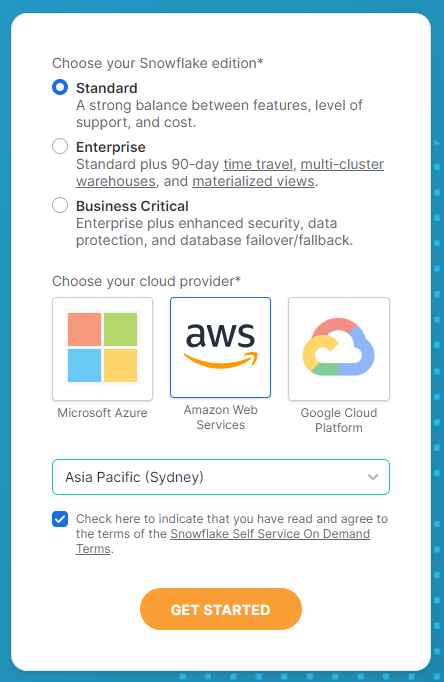

# Instruction

## Task
Sign up a trail account in Snowflake.

### Fill in basic info

### Choose Edition and Cloud provider

### Go to email

### Click activate

### Set password

### Note the URL in the activation email
- It is where you log in.
- It contains your identifier. In my case, it is **JB64263.ap-southeast-2**

### UI exploration
- Classic vs. Snowsight
- Find these
  - Database
  - Virtual warehouses
  - Worksheets
  - Query history
  - Usage and billing info
  - Users and roles
