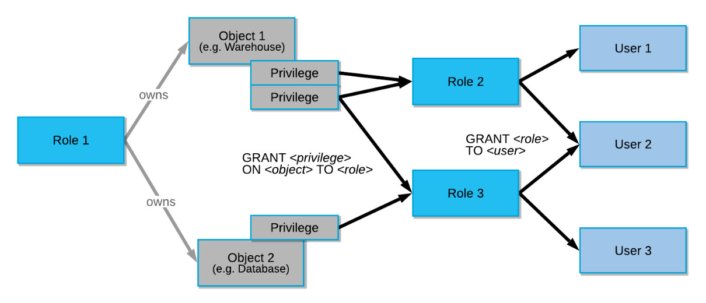
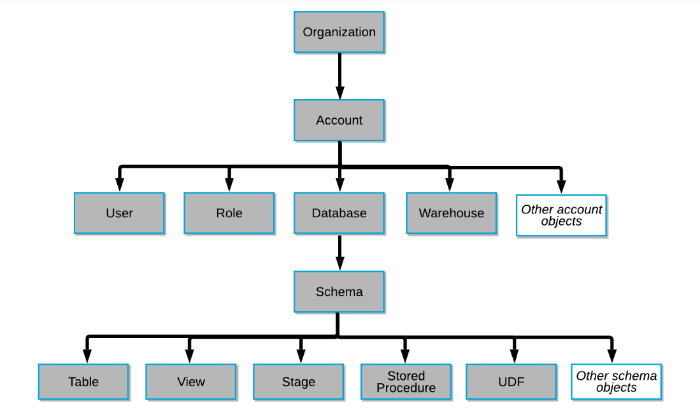
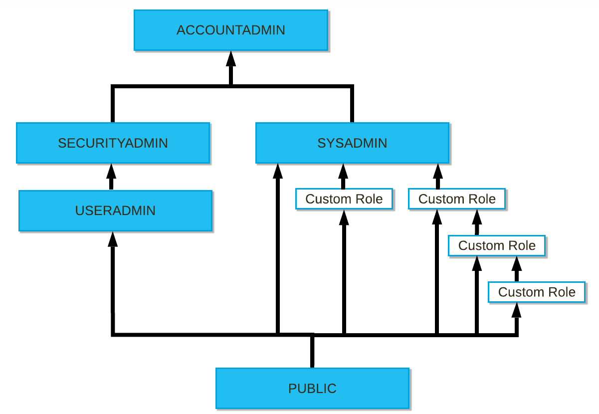
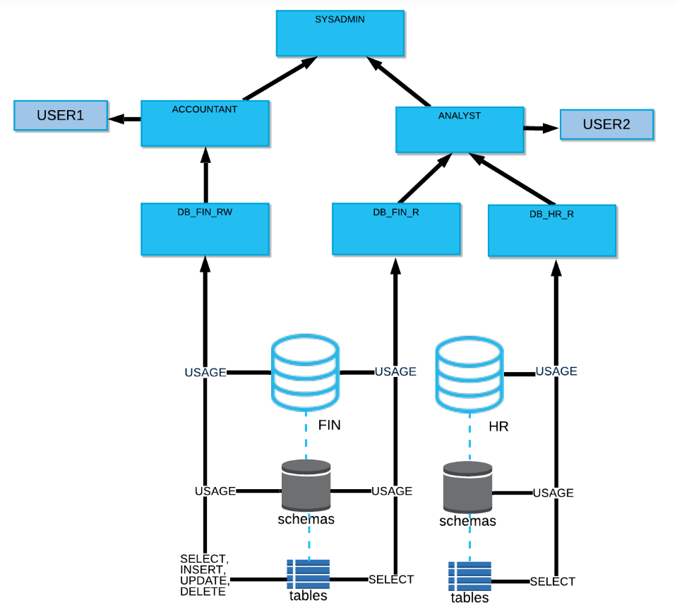

# Instruction
You are let known that the company currently have
- HR data, like employees, departments, managers etc.
- Salary data, in dollar amount

The Payroll Officer is outsourced. So we would like them have read access to the salary info only.

However, HR needs to know both company structure and salaries in order to run some adhoc reports.

When it comes to data updates, HR is authorised to manually update HR info, although via ETL process is preferred.

The Big Boss wants salaries modified only by the ETL process.

And of course, you'll be using dbt to run ETL. It needs to access data too.

So you wonder how to allow different tools and users access Snowflake in a well-governed way?

## Concept

### Access control
#### Principle
- **Discretionary Access Control (DAC)**: Each object has an owner, who can in turn grant access to that object.
- **Role-based Access Control (RBAC)**: Access privileges are assigned to roles, which are in turn assigned to users.

#### Key concepts:
- Securable object
- Role
- Privilege
- User

#### Securable objects

#### System default roles
- **ORGADMIN**: Manages accounts in the organization (account != user)
- **ACCOUNTADMIN**: Top Boss in a certain account, but not a superuser
- **SECURITYADMIN**: Manage grants
- **USERADMIN**: Manage user and roles
- **SYSADMIN**: Manage storage and computing resources
- **PUBLIC**: Default, available to everyone

#### RBAC example

## Task
Now you are clear that in order for users and dbt to access Snowflake, you'll need to have these created:

---
owned by **SYSADMIN**
- warehouse: QUERY
- warehouse: ETL
---
owned by **SYSADMIN**
- database: HR
  - schema: SOURCE | stores raw tables
  - schema: MODEL | stores transformed tables
  - schema: EXPOSE | stores views that selectively share data with the public
  - schema: UTIL | stores non table/view objects
- database: PAYROLL
  - schema: SOURCE
  - schema: MODEL
  - schema: EXPOSE
  - schema: UTIL
---
user owned by **USERADMIN**, role granted by **SECURITYADMIN**
- role: DBT_RW
- user: dbt
---
- role: HR_RW
- role: PAYROLL_R
- user: jane_the_hr
- user: joe_the_payroll
---
Grant Privilege, [SQL reference](https://docs.snowflake.com/en/sql-reference/sql/grant-privilege.html)

