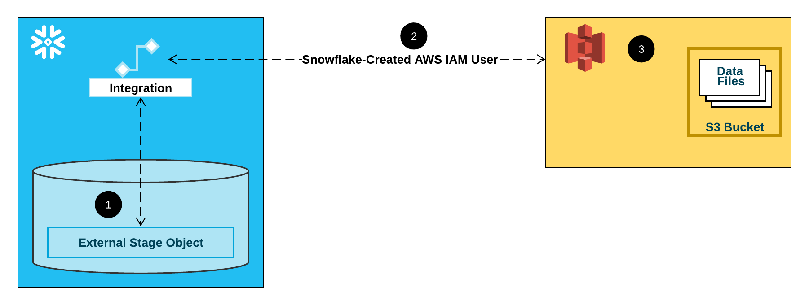

# Instruction

## Task
1. Follow `bulkload_ins.sql` to load data.
2. Work on `bulkload_stu.sql` 
   - Load the rest of the tables for HR (using role `HR_RW`)
   - Load the salary table for payroll officer (using role `DBT_RW` manually for now)

---
### General steps
- Upload data files into `S3`
  - Note that you should have two folders under root, namely payroll and hr
- Create in AWS
  - `IAM` policy
  - `IAM` role
- Create in Snowflake
  - `STORAGE INTEGRATION`
  - `FILE FORMAT`
  - `STAGE`
- Run the `COPY` command

---

### Steps on creating a `storage integration`
1. Create a non-public S3 bucket and upload all the files
2. Create an IAM policy (called `snowflake_access`) using JSON allowing both read and write on the whole bucket.
```
{
    "Version": "2012-10-17",
    "Statement": [
        {
            "Effect": "Allow",
            "Action": "s3:ListBucket",
            "Resource": "arn:aws:s3:::<YOUR_BUCKET>",
            "Condition": {
                "StringLike": {
                    "s3:prefix": "*"
                }
            }
        },
        {
            "Effect": "Allow",
            "Action": [
                "s3:PutObject",
                "s3:GetObject",
                "s3:DeleteObjectVersion",
                "s3:DeleteObject",
                "s3:GetObjectVersion"
            ],
            "Resource": "arn:aws:s3:::<YOUR_BUCKET>/*"
        },
        {
            "Effect": "Allow",
            "Action": "s3:GetBucketLocation",
            "Resource": "arn:aws:s3:::<YOUR_BUCKET>"
        }
    ]
}
```
3. Create an IAM role (called `snowflake_role`)
   1. Trusted entity type: AWS account
   2. Trust "this account" for now
   3. Tick "Require external ID" and put in a dummy value 000 for now
   4. Assign the policy above
4. Note the ARN e.g. `arn:aws:iam::931718146526:role/snowflake_role`
5. `CREATE STORAGE INTEGRATION <YOUR_INTEGRATION>` using the role ARN
6. `DESC INTEGRATION <YOUR_INTEGRATION>` and note `STORAGE_AWS_IAM_USER_ARN` and `STORAGE_AWS_EXTERNAL_ID`
7. Edit Trusted Relationships of your role with the above 2 values

