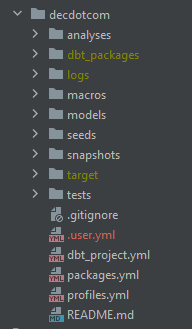
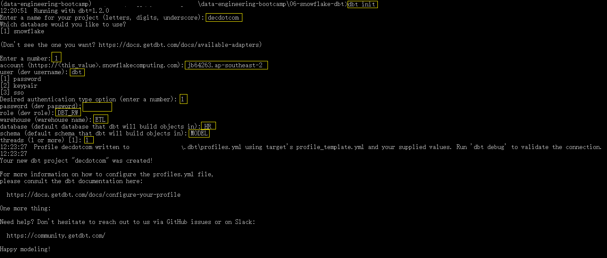
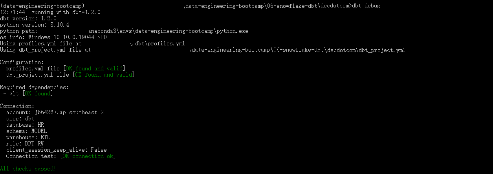

# Instruction

Right after you finished loading the data files, just when you thought you could have a coffee break, Jane the HR came to you.

She asked if you could build some logic to calculate the average salary of all the current senior engineers by the year they became senior.

This is to analyse if the company underpays employees who have longer tenure.

Sure, you answered, without any idea how to do that using dbt. In fact, you don't have dbt installed at all!

## Concept
### What is dbt
dbt stands for data build tool. It is the T in ELT.

It has 2 commonly used distributions:
- dbt core - open source, free to use, installed as a Python package
- dbt Cloud - commercial product, SaaS

dbt is an awesome tool because:
- SQL! (and more)
- makes SQL logic modular
- DAG and Doc

The foremost concept in dbt is a **model**:
- A model is a piece of SQL `SELECT` logic
- You could put some Jinja and `macros` in SQL to generalise it as a template
- A model can be materialised in different ways e.g. tables and views
- Dependencies in models make them DAGs

### Project structure
A typical dbt project consists of:
- **A few folders.** They are important concepts in dbt. And also the main functionalities. (we will go through each)
- **dbt_project.yml** This file sets a few configs and default behaviours.
- **packages.yml** This file specifies the packages you need for your project (like requirements.txt)
- **profiles.yml** This file specifies target and connections. By default, it is in your project.

## Task
dbt is such an easy-to-use tool that you instantly know you are going to build a model and materialise it into a table.

### Installation
1. Open your Conda Prompt
2. Activate your virtual environment `conda activate <DIR>\anaconda3\envs\data-engineering-bootcamp`
3. This will install dbt-core and its snowflake specific packages `pip install dbt-snowflake`
4. Go to the directory where your dbt project is going to be `cd <DIR>\data-engineering-bootcamp\06-snowflake-dbt`
5. `dbt init` and fill in as needed. Recall the account, the role, the dbt user and the warehouse we created.

6. At this point, you should have a folder called `decdotcom`. This is your dbt project folder.
7. `cd decdotcom`
8. `dbt debug` to verify the connection.

