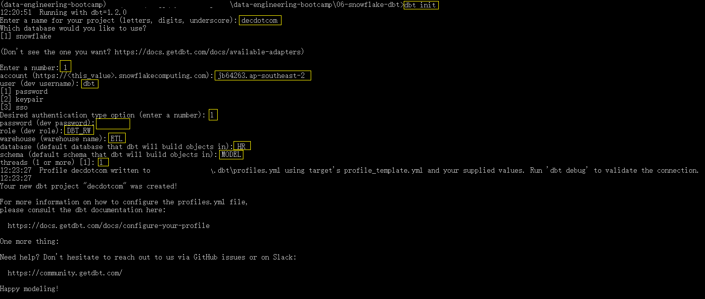
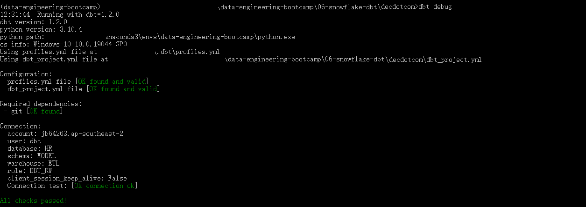

# Instruction

## Task
Install dbt 

### Installation
1. Open your Conda Prompt
2. Activate your virtual environment `conda activate <DIR>\anaconda3\envs\data-engineering-bootcamp`
3. This will install dbt-core and its snowflake specific packages `pip install dbt-snowflake`
4. Go to the directory where your dbt project is going to be `cd <DIR>\data-engineering-bootcamp\06-snowflake-dbt`
5. `dbt init` and fill in as needed. Recall the account, the role, the dbt user and the warehouse we created.

6. At this point, you should have a folder called `decdotcom`. This is your dbt project folder.
7. `cd decdotcom`
8. `dbt debug` to verify the connection.

