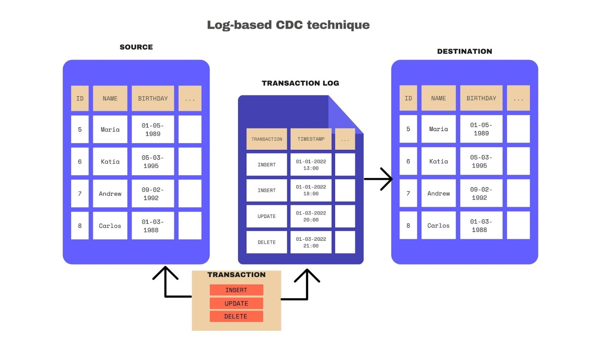

# Instruction

## Concept 

In the Airbyte week, we have seen a few ways to extract data.

Extracting data directly from source tables can have several downsides: 
- Introducing load directly to source tables 
- Requires a cursor field based on a timestamp to fetch data incrementally

However, we can extract data using a table's transaction log. This approach is known as Change Data Capture (CDC). 

Benefits of this approach: 
- The query does not impact the source table. 
- Only new transactions are extracted without the need for a cursor field based on a timestamp. 
- Amortised ingestion load in the target database

To support log-based CDC, Airbyte uses Debezium, an open-source platform that constantly monitors your databases, allowing your applications to stream database row-level changes. Airbyte is engineered to use Debezium as an embedded library, so you don’t need to worry about knowing its specifics.

CDC is often a common option in many commercial data tools. There are cloud natives ones as well e.g. AWS DMS.

## Task
1. [Set up](https://docs.airbyte.com/integrations/sources/postgres#configuring-postgres-connector-with-change-data-capture-cdc) Postgres
   1. Create table, insert data
   2. Create read only user, grant role
   3. Update parameter group and restart database
   4. Create replication slot
   5. Create publication
2. Create Postgres Source in Airbyte
3. [Set up](https://docs.airbyte.com/integrations/destinations/snowflake) Snowflake
4. Create Snowflake Destination in Airbyte
5. Insert and update data to observe CDC
