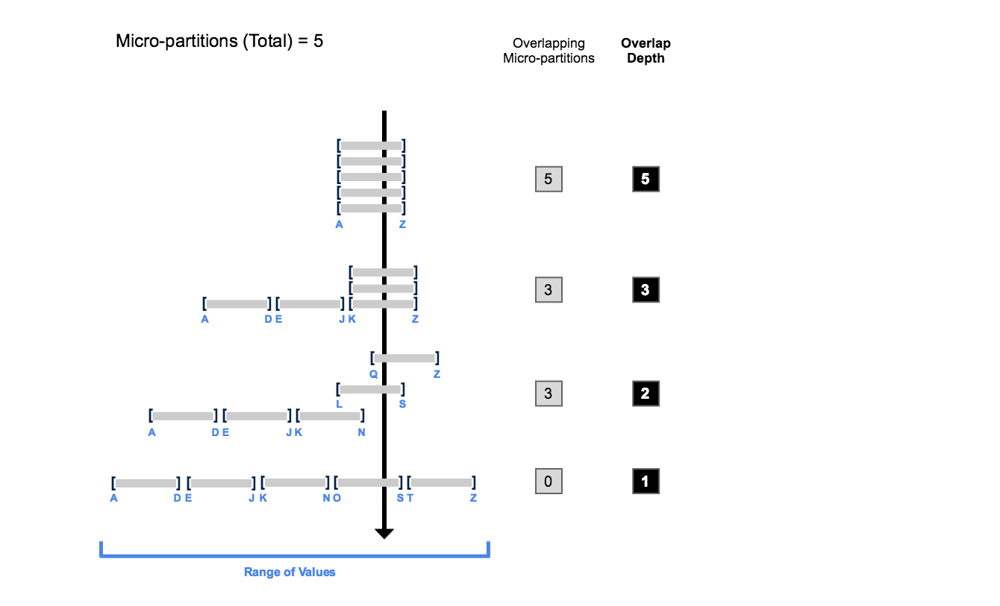
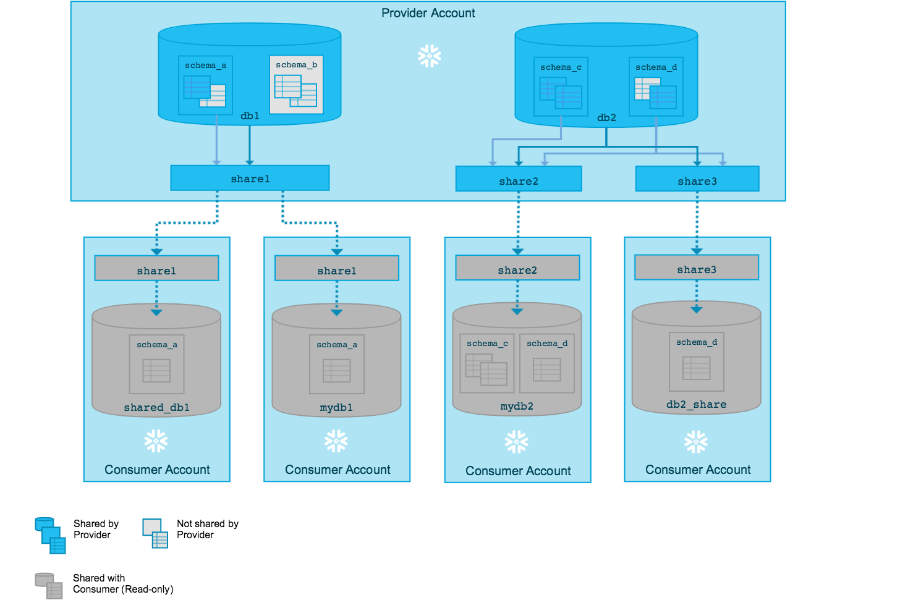

# Instruction

## Concept

### More on Clustering
Is a clustering key performing well?
1. Check query plan and see the partitions scanned vs total

Run this on size S warehouse and check query plan.
```
USE SCHEMA snowflake_sample_data.tpcds_sf10tcl;
select /* { "query":"query07","streamId":0,"querySequence":2 } */  i_item_id,
        avg(ss_quantity) agg1,
        avg(ss_list_price) agg2,
        avg(ss_coupon_amt) agg3,
        avg(ss_sales_price) agg4
 from store_sales, customer_demographics, date_dim, item, promotion
 where ss_sold_date_sk = d_date_sk and
       ss_item_sk = i_item_sk and
       ss_cdemo_sk = cd_demo_sk and
       ss_promo_sk = p_promo_sk and
       cd_gender = 'M' and
       cd_marital_status = 'D' and
       cd_education_status = 'College' and
       (p_channel_email = 'N' or p_channel_event = 'N') and
       d_year = 2001
 group by i_item_id
 order by i_item_id
 limit 100;
```
2. Check partition overlap depth

`SELECT SYSTEM$CLUSTERING_INFORMATION('SNOWFLAKE_SAMPLE_DATA.TPCH_SF1000.ORDERS');`



### Zero-copy Cloning
- Instantly take a “snapshot” of any table, schema, or database and create a derived copy
- Initially shares the underlying storage
- Useful for creating instant backups that do not incur any additional costs
- Pay for storage of changes

### Materialised Views
- Pre-computed and stored for later use
- Incurs additional costs $$$
  - Storage
  - Compute
- Snowflake automatically keeps data up-to-date
- Only use when
  - Base table does not change frequently
  - Takes too long to calculate the logic

### Dynamic Data Masking
What is Dynamic Data Masking?
- Column-level Security
- Uses masking policies to selectively mask plain-text columns at query time
- Masking policies are schema-level objects

```
create or replace masking policy email_mask as (val string) returns string ->
  case
    when current_role() in ('ANALYST') then val
    else '*********'
  end;
```

### Tasks
- Cron job
- DAG

```
CREATE TASK mytask_minute
  WAREHOUSE = mywh
  SCHEDULE = '5 MINUTE'
AS
INSERT INTO mytable(ts) VALUES(CURRENT_TIMESTAMP);
```

### Snowpark
API library for Java, Scala and Python.

```python
from snowflake.snowpark import Session
```

### UDF
| Language     | Tabular | Looping and Branching | Pre-Compiled or Staged Source | In-line | Sharable | 
|--------------|---------|-----------------------|-------------------------------|---------|----------| 
| SQL          | Yes     | No                    | No                            | Yes     | Yes      |
| JavaScript   | Yes     | Yes                   | No                            | Yes     | Yes      |
| Java         | Yes     | Yes                   | Yes (precompiled)             | Yes     | No       |
| Python       | Yes     | Yes                   | Yes (staged)                  | Yes     | Yes      |

```
CREATE FUNCTION area_of_circle(radius FLOAT)
  RETURNS FLOAT
  AS
  $$
    pi() * radius * radius
  $$
  ;
```

### Secure Data Sharing
- No actual data is copied or transferred
- Only between Snowflake accounts
- Read only


### Streams
- CDC
```
create or replace stream member_check on table members;

select * from member_check;
+----+--------+-----+-----------------+-------------------+------------------------------------------+
| ID | NAME   | FEE | METADATA$ACTION | METADATA$ISUPDATE | METADATA$ROW_ID                          |
|----+--------+-----+-----------------+-------------------+------------------------------------------|
|  1 | Joe    |  90 | INSERT          | False             | 957e84b34ef0f3d957470e02bddccb027810892c |
|  2 | Jane   |  90 | INSERT          | False             | b00168a4edb9fb399dd5cc015e5f78cbea158956 |
|  3 | George |  90 | INSERT          | False             | 75206259362a7c89126b7cb039371a39d821f76a |
|  4 | Betty  |   0 | INSERT          | False             | 9b225bc2612d5e57b775feea01dd04a32ce2ad18 |
|  5 | Sally  |   0 | INSERT          | False             | 5a68f6296c975980fbbc569ce01033c192168eca |
+----+--------+-----+-----------------+-------------------+------------------------------------------+
```

### Sampling
Returns a subset of rows sampled randomly from the specified table.
```
select * from testtable tablesample bernoulli (20.3);
```