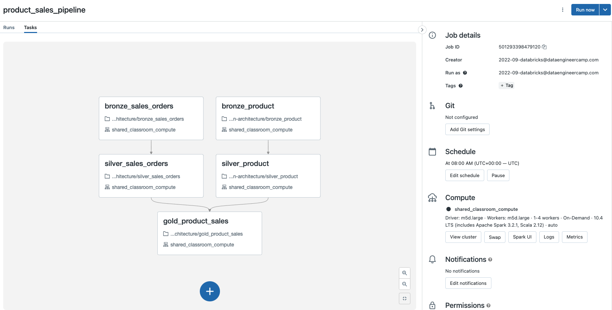

# Instruction

## Concept

Databricks Workflows are used to orchestrate notebooks in a Directed Acyclic Graph (DAG). 

## Task 

- Refer to the steps here on how to create a Databricks Workflow: https://docs.databricks.com/workflows/jobs/jobs.html 
- Create a workflow for the notebooks in this folder 
