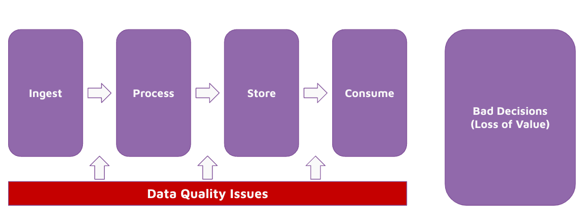
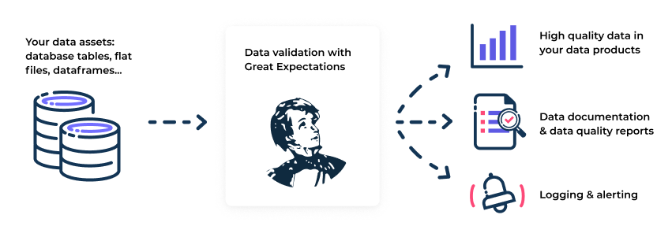

# Instruction

## Concept 

Data quality issues can occur at any part of the pipeline. A data quality issue will result in bad decisions made and therefore a loss of value. 

To avoid data quality issues, we can use Great Expectations, a library used to perform data quality tests. 

## Task 

- Update the notebooks in `05-ins-great-expecations/unsolved` to include great expectation tests. 
