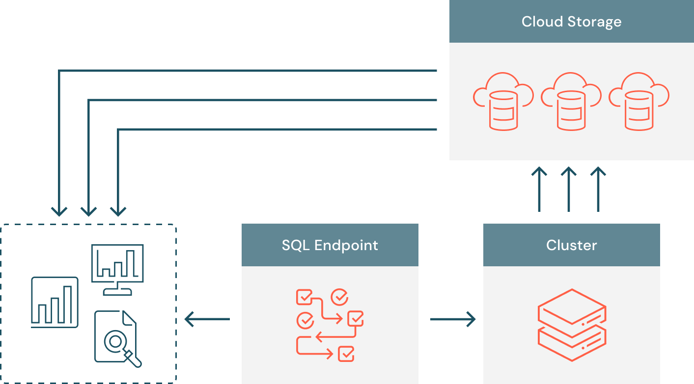
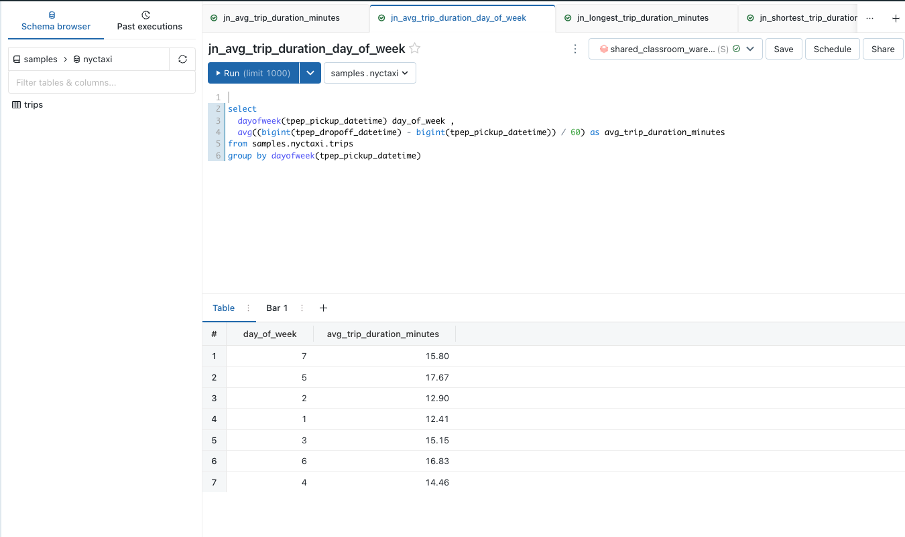
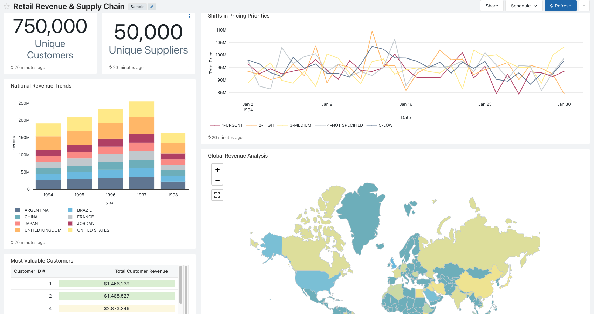
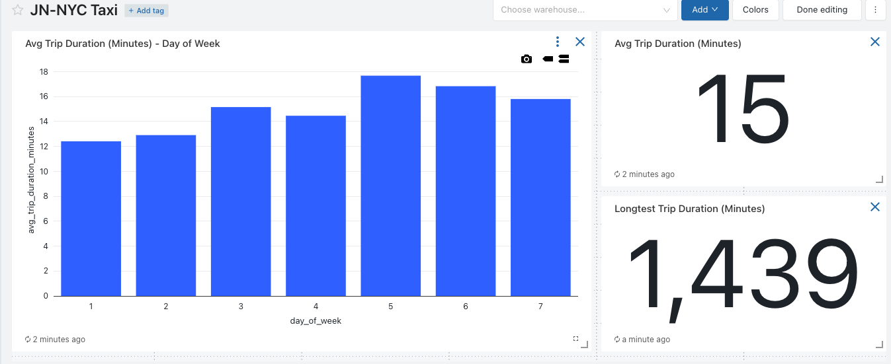

# Instructions

## Concept 

### Databricks SQL Warehouse 

Databricks SQL Warehouse is similar to a using a Data Warehouse SQL (Snowflake, BigQuery, Synapse). 



### Databricks SQL Query Editor

The SQL Editor looks similar to other SQL editors most people are familiar with e.g. SQL Server Management Studio (SSMS), PgAdmin4. 



Databricks SQL Warehouse has several built-in functions: https://docs.databricks.com/sql/language-manual/sql-ref-functions-builtin.html 

### Databricks SQL Dashboard

We can create a dashboards that look like this. 



## Task 

### 1. Write the following queries

**avg_trip_duration_day_of_week**

```sql
select 
  dayofweek(tpep_pickup_datetime) day_of_week , 
	avg((bigint(tpep_dropoff_datetime) - bigint(tpep_pickup_datetime)) / 60) as avg_trip_duration_minutes
from samples.nyctaxi.trips 
group by dayofweek(tpep_pickup_datetime)
```

**max_trip_duration**

```sql
select 
	max((bigint(tpep_dropoff_datetime) - bigint(tpep_pickup_datetime)) / 60) as avg_trip_duration_minutes
from samples.nyctaxi.trips 
```

**avg_trip_duration**

```sql
select 
	avg((bigint(tpep_dropoff_datetime) - bigint(tpep_pickup_datetime)) / 60) as avg_trip_duration_minutes
from samples.nyctaxi.trips 
```

### 2. Create a dashboard 


