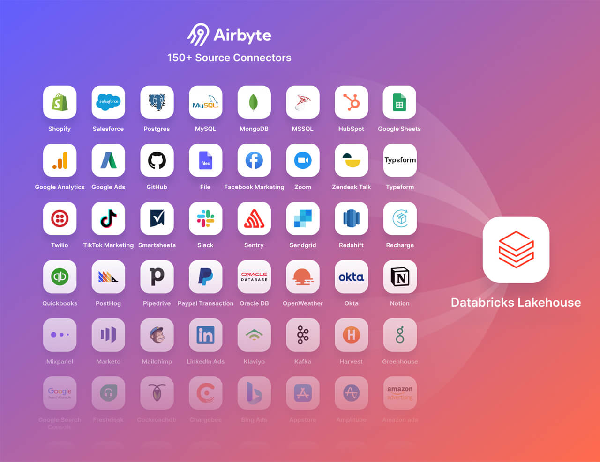

# Instructions 

## Concept 

We can use Airbyte to ingest data into Databricks. 

## Task 

1. Perform steps detailed in this article (note: this has already been done for you in the shared AWS account): https://docs.databricks.com/administration-guide/cloud-configurations/aws/instance-profiles.html
2. Follow instructions on this article to sync data from Postgres to Databricks using Airbyte: https://docs.airbyte.com/integrations/destinations/databricks/ 

