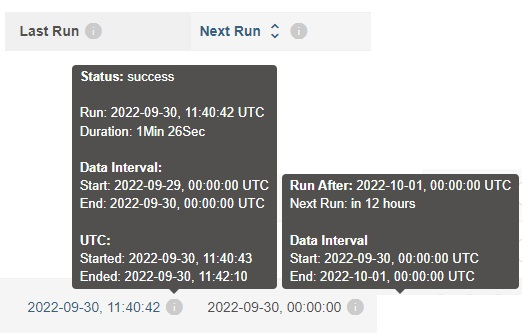
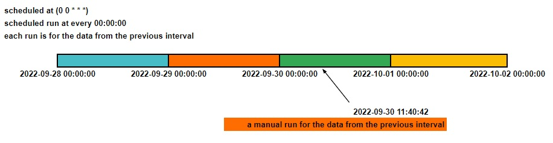

# Instruction

## Concept

### DAG
Treat DAG file as a configuration file specifying the DAG’s structure as code.

The actual tasks defined here will run in a different context from the context of this file.

Not for cross communication between tasks.

Not for actual data processing.


### Operators
An operator defines a unit of work for Airflow to complete. 

All operators inherit from the BaseOperator and so as its parameters. Different operators have their own unique parameters as well.

Some of the most popular operators are the PythonOperator, the BashOperator, and the KubernetesPodOperator.


### Tasks
To use an operator in a DAG, you have to instantiate it as a task.

A task must include or inherit the arguments `task_id` and `owner`.


### Task Dependencies
```
t1.set_downstream(t2)
t2.set_upstream(t1)
t1.set_downstream([t2, t3])
```
```
t1 >> t2
t2 << t1
t1 >> t2 >> t3
t1 >> [t2, t3]
[t2, t3] << t1
```

```
from airflow.utils.edgemodifier import Label

my_task >> Label("When empty") >> other_task
```

### DAG parameters
Some important ones

```
dag_id (str) – The id of the DAG; must consist exclusively of alphanumeric characters, dashes, dots and underscores (all ASCII)

description (Optional[str]) – The description for the DAG to e.g. be shown on the webserver

schedule (ScheduleArg) – Defines the rules according to which DAG runs are scheduled. Can accept cron string, timedelta object, Timetable, or list of Dataset objects. See also Customizing DAG Scheduling with Timetables.

start_date (datetime | None) – The timestamp from which the scheduler will attempt to backfill

end_date (Optional[datetime.datetime]) – A date beyond which your DAG won’t run, leave to None for open ended scheduling

dagrun_timeout (timedelta | None) – specify how long a DagRun should be up before timing out / failing, so that new DagRuns can be created. The timeout is only enforced for scheduled DagRuns.

default_args (Optional[Dict]) – A dictionary of default parameters to be used as constructor keyword parameters when initialising operators. Note that operators have the same hook, and precede those defined here, meaning that if your dict contains ‘depends_on_past’: True here and ‘depends_on_past’: False in the operator’s call default_args, the actual value will be False.

catchup (bool) – Perform scheduler catchup (or only run latest)? Defaults to True

tags (Optional[List[str]]) – List of tags to help filtering DAGs in the UI.

on_failure_callback (Optional[DagStateChangeCallback]) – A function to be called when a DagRun of this dag fails. A context dictionary is passed as a single parameter to this function.

on_success_callback (Optional[DagStateChangeCallback]) – Much like the on_failure_callback except that it is executed when the dag succeeds.

access_control (Optional[Dict]) – Specify optional DAG-level actions, e.g., “{‘role1’: {‘can_read’}, ‘role2’: {‘can_read’, ‘can_edit’, ‘can_delete’}}”

render_template_as_native_obj (bool) – If True, uses a Jinja NativeEnvironment to render templates as native Python types. If False, a Jinja Environment is used to render templates as string values.
```


### Schedule

This is what people often get confused at.





- Use start of the data interval and end of the data interval to define a DAG run.
- The actual datatime of a DAG run? It's not a thing. The closet one is the logical date, which is either scheduled run time or manual run time.
- Why the example DAG got triggered when I enable it? 
  - When you enable a DAG, a run will be created for the start_date. 
  - The rest will be created by the scheduler. If `catchup=False`, then these are skipped.

### Catchup

Kick off DAG Runs for all data interval that has not been run since the last data interval.


### Idempotence

Idempotence means no matter how many times you run a DAG or task, it achieves the same result.

This concept can't be stressed enough. Read this word aloud 3 times before you write any DAG.

Idempotence is important because catchup relies on it.

You DAGs & tasks should be dependent on the data intervals, so that they are repeatable and the results are reproducible.


### Reference
[Templates](https://airflow.apache.org/docs/apache-airflow/stable/templates-ref.html)
[Pendulum](https://pendulum.eustace.io/docs/#introduction)


## Task
1. Enable `example_do_run_when_enabled` and `example_no_run_when_enabled`
2. Manually trigger `example_do_run_when_enabled`
3. Check log for `{{ ts }}` `{{ data_interval_start }}` and `{{ data_interval_end }}`
4. Enable `example_catchup` and see how many DAGs will run 
5. Check log for `{{ ts }}` `{{ data_interval_start }}` and `{{ data_interval_end }}`
