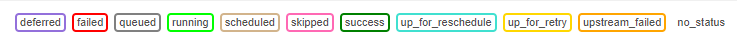
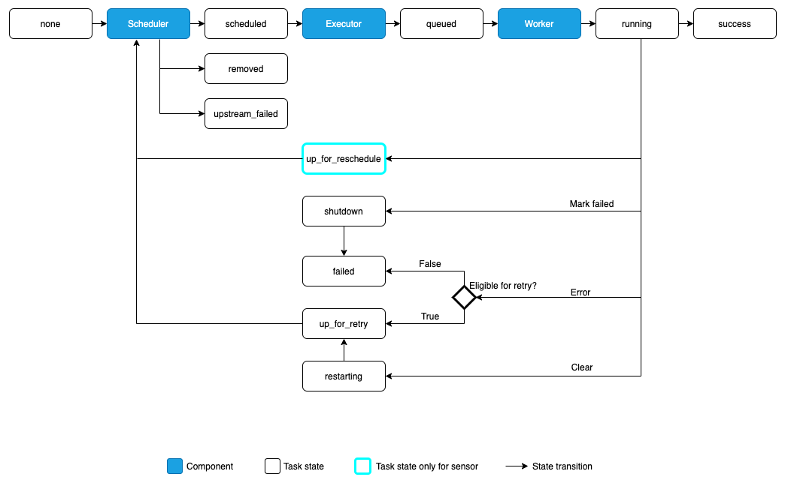
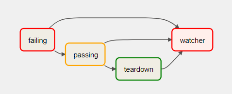

# Instruction

## Concept

### Task status
Airflow has many task statuses. 



The lifecycle is illustrated as:



Some are related to scheduling. Some are related to execution outcome.

```
none: The Task has not yet been queued for execution (its dependencies are not yet met)

scheduled: The scheduler has determined the Task’s dependencies are met and it should run

queued: The task has been assigned to an Executor and is awaiting a worker

running: The task is running on a worker (or on a local/synchronous executor)

success: The task finished running without errors

shutdown: The task was externally requested to shut down when it was running

restarting: The task was externally requested to restart when it was running

failed: The task had an error during execution and failed to run

skipped: The task was skipped due to branching, LatestOnly, or similar.

upstream_failed: An upstream task failed and the Trigger Rule says we needed it

up_for_retry: The task failed, but has retry attempts left and will be rescheduled.

up_for_reschedule: The task is a Sensor that is in reschedule mode

deferred: The task has been deferred to a trigger

removed: The task has vanished from the DAG since the run started
```

But ultimately each task will end with
- success
- upstream_failed
- failed
- skipped

### Trigger rules

Trigger rule is a task configuration. The default is `all_success`.

A task is triggered only when a task's immediate upstream tasks satisfy the trigger rule. 

- all_success
- all_failed
- all_done
- one_success
- one_failed
- none_failed
- none_failed_or_skipped
- none_skipped
- dummy
- always
- none_failed_min_one_success
- all_skipped

### Watcher pattern

These concepts lead us to the Watcher pattern.

Watcher pattern: A DAG with a task that is “watching” the states of the other tasks.

It is to fail a DAG Run when any other task fails.



An example:

Teardown task (TriggerRule.ALL_DONE) - will be executed regardless of the state of the other tasks.

This task will always run. If the teardown task succeeds, the DAG succeeds. Any task that fails in the middle are not directly reflected to us.

Introducing:

Watcher task (TriggerRule.ONE_FAILED) - will always fail if triggered, needs to be a downstream task for all other tasks.