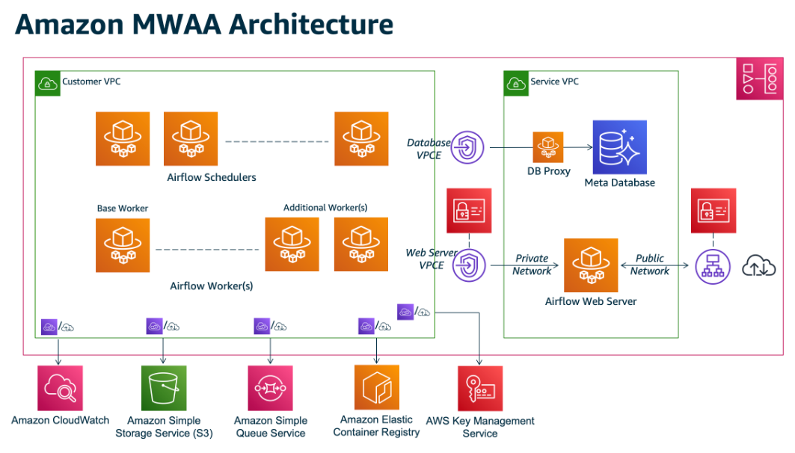

# Instruction

## Concept

Given the complexity of Airflow components, many Cloud service providers have their own managed Airflow.

For example, MWAA on AWS and Cloud Composer on GCP.

### MWAA

MWAA requires:
- A private VPC
- DAG folder in S3
- An optional requirements.txt in S3

MWAA is easy to set up, but it takes about 30 mins for AWS to provision everything.

AWS provides a local version that you can use to simulate MWAA: [local-runner](https://github.com/aws/aws-mwaa-local-runner) 

## Task

Set up:
1. create a new s3 bucket with versioning enabled
2. upload dags files into dag folder, upload requirements.txt
3. use MWAA 2.2.2
4. set s3 bucket, dag folder, requirements
5. create mwaa vpc (which goes to cloudformation, use all default values)
6. refresh and select the created vpc, use its private subnets
7. webserver - public network
8. tick create new security group
9. small size, maximum worker count = 1
10. execution role - let AWS create new role
11. run an example DAG and check logs

Clean Up:
1. Delete the MWAA environment
2. Delete the MWAA security group
3. In CloudFormation, delete the CloudFormation Stack
4. Delete the files in S3