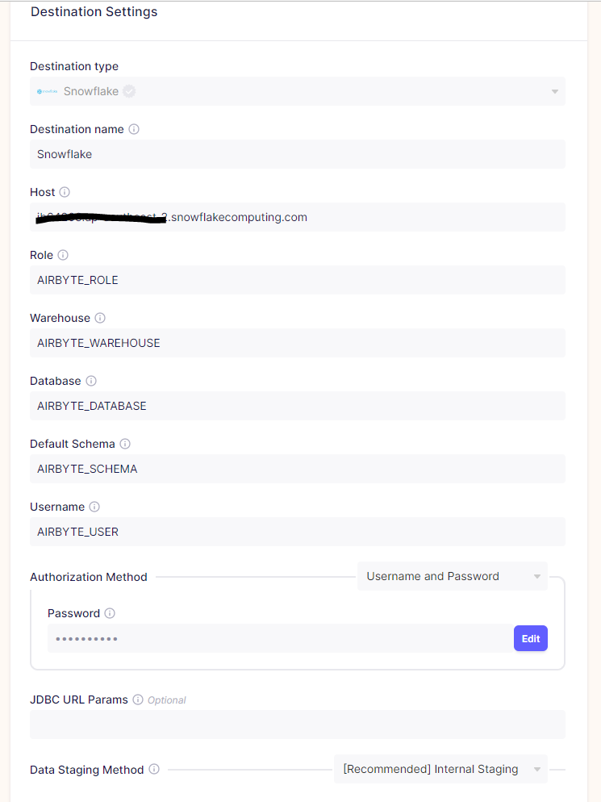
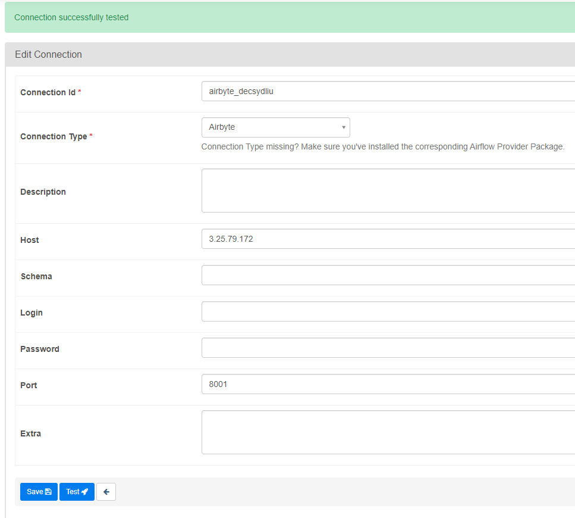

# Instruction

## Task

### Airbyte
Make sure `tcp:8001` open in the security group.

If restarting, `sudo systemctl start docker` to start docker service

Access UI at `http://<public_address>/8000`

APIs are sent to `:8001`

### Snowflake Destination

On the right, there is a Step Guide for Snowflake.

Run the code in Step 1 to set Airbyte up in Snowflake.

Fill in the left panel with the values from the code.



### Postgres <> Snowflake Airbyte Connection

Set up a Postgres <> Snowflake Connection in Airbyte. Configure the streams and tables correctly.

### Airflow Connection for Airbyte

Create an Airbyte Connection in Airflow.

Host: the public IP
Port: 8001



### Airbyte Operator

Airbyte Operator has 2 modes.

When using the asynchronous mode, a separate sensor can be used to detect if the job is finished.

When using the synchronous mode, set `timeout` and `wait_second`.

`http://3.25.79.172:8000/workspaces/0bbaa56c-fc1c-40b1-9eae-95b7f66c7844/connections/4eb30ef4-c99c-4f1d-8f5d-414da3668523/status`

The connection id can be fetched from the url. For the above url, the id is `4eb30ef4-c99c-4f1d-8f5d-414da3668523`

```
trigger_sync = AirbyteTriggerSyncOperator(
    task_id='trigger_sync',
    airbyte_conn_id=airbyte_conn_id,
    connection_id=airbyte_pgsf_conn_id,
    asynchronous=False,
    timeout=3600,
    wait_seconds=3
)
```


```
async_source_destination = AirbyteTriggerSyncOperator(
    task_id='airbyte_async_source_dest_example',
    airbyte_conn_id=airbyte_conn_id,
    connection_id=airbyte_pgsf_conn_id,
    asynchronous=True,
)

airbyte_sensor = AirbyteJobSensor(
    task_id='airbyte_sensor_source_dest_example',
    airbyte_conn_id=airbyte_conn_id,
    airbyte_job_id=async_source_destination.output,
)
```