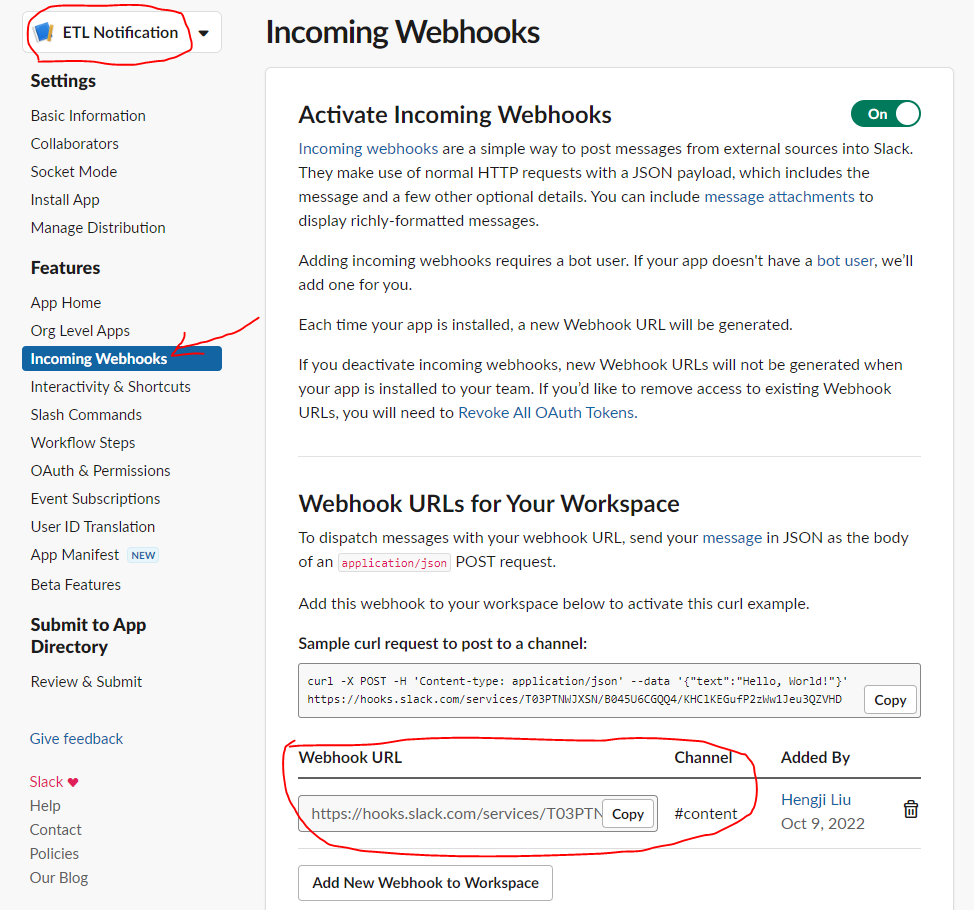

# Instruction

## Task

In general, check the provider's document page for usage instructions.

This section shows how to integrate some tools into your ETL DAG.

### Databricks

[Databricks Provider](https://airflow.apache.org/docs/apache-airflow-providers-databricks/stable/operators/index.html)

`DatabricksRunNowOperator` triggers a job immediately.

Set up the Databricks connection and the operator like this.

```
    DatabricksRunNowOperator(
        task_id='databricks_run_now',
        databricks_conn_id='databricks_dec',
        job_id='599846188147567'
    )
```

- job_id: from Databricks when you have a job selected
- host: from Databricks URL
- password: in Databricks, go to `User Settings` -> `Access tokens` -> `Generate new token`


### Slack Notifications

[Slack Provider](https://airflow.apache.org/docs/apache-airflow-providers-slack/stable/_api/airflow/providers/slack/operators/slack_webhook/index.html)

```
    etl_start = SlackWebhookOperator(
        task_id="etl_start",
        http_conn_id="slack_dec",
        message="ETL started",
        channel="#content"
    )
```

- Go to `https://api.slack.com/` to create a new app
- Choose `From Scratch`
- Name your app and choose the right workspace
- In your app (my app is called ETL Notification in the screenshot), navigate to `Incoming Webhooks`
- `Add a New Webhook to Workspace`, set the right channel
- Copy the webhook URL
- Set up the Slack connection using the `HTTP` type
- Host is `https://hooks.slack.com/services`
- The rest of the URL (starting from `/`) is password
- Remember to add your app to your Slack channel (top right of the channel where you manage members)





### SQL

Some operators take SQL statements directly. 

It is better to have your SQL statements in a separate `sql` folder, just like the `function` folder we created.

[Snowflake Provider](https://airflow.apache.org/docs/apache-airflow-providers-snowflake/stable/operators/index.html)
[Postgres Provider](https://airflow.apache.org/docs/apache-airflow-providers-postgres/stable/operators/postgres_operator_howto_guide.html)

### Email

You can use it from either the `EmailOperator` or the `email_on_failure` parameter.
```
    email_task = EmailOperator(
        task_id="send_email",
        to="decsydliu@outlook.com",
        subject="test email operator",
        html_content="test email operator text text text",
    )

    failing_task = BashOperator(task_id="failing", bash_command="exit 1", retries=0,
                                email_on_failure=True, email="decsydliu@outlook.com")

    email_task >> failing_task
```

Use Gmail as an example. This requires 2FA to be setup first.

- Go to `https://myaccount.google.com/apppasswords`
- Create an app password for `Mail`
- Update `smtp` section in `airflow.cfg` as below


```editorconfig
[smtp]
# If you want airflow to send emails on retries, failure, and you want to use
# the airflow.utils.email.send_email_smtp function, you have to configure an
# smtp server here
smtp_host = smtp.gmail.com
smtp_starttls = True
smtp_ssl = False
# Example: smtp_user = airflow
smtp_user = <YOUR GMAIL HERE>
# Example: smtp_password = airflow
smtp_password = <YOUR APP PASSWORD HERE>
smtp_port = 587
smtp_mail_from = <YOUR GMAIL HERE>
smtp_timeout = 30
smtp_retry_limit = 5
```

