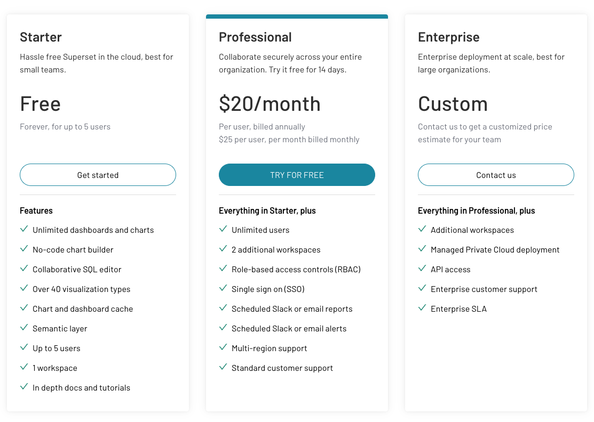
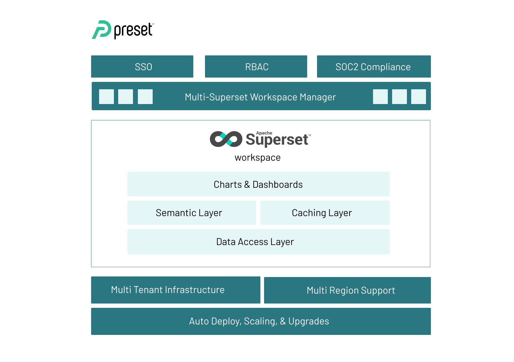

# Instruction 

## Preset pricing 

Preset is free for up to 5 users, with 1 workspace and but no API access. 

## Create a new preset account 

1. Go to https://preset.io/ and click on "start for free"
2. Step through the pages and complete your account creation 

## Understanding preset 

- Preset provides a cloud wrapper around the the open-source apache superset project 
- The main components of superset are: 
    - Data access layer: provides connectors to different databases e.g. Snowflake, BigQuery, Databricks. 
    - Semantic layer: provides an OLAP cube engine to easily send slice and dice queries to the analytical database.  
    - Caching layer: stores results returned from the semantic layer's query in a redis cache for better performance. 
    - Charts and dashboards: uses D3.js chart libraries to construct charts, and uses cross-filters to slice and dice charts in a dashboard. 
