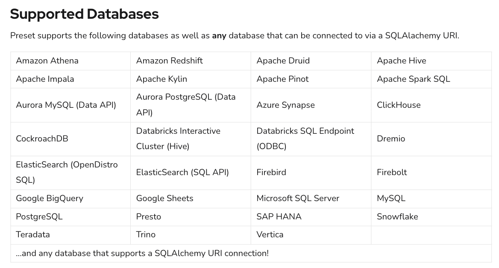

# Instruction

## Concept 

Preset supports a wide range of connectors to databases. Preset supports any database that can be connected to via a SQLAlchemy URI. 

## Connect to AWS RDS AdventureWorks database 

Create a connection to the AWS RDS database using the [instructions here](https://docs.preset.io/docs/postgres-connection).

