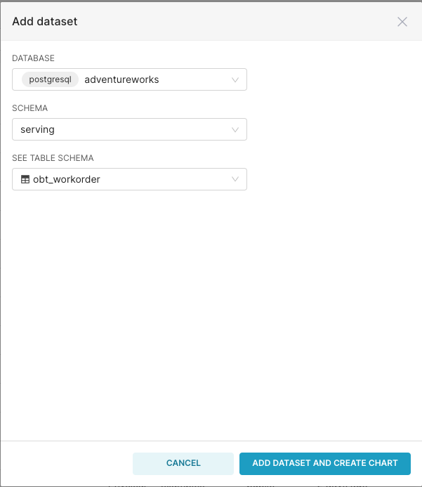
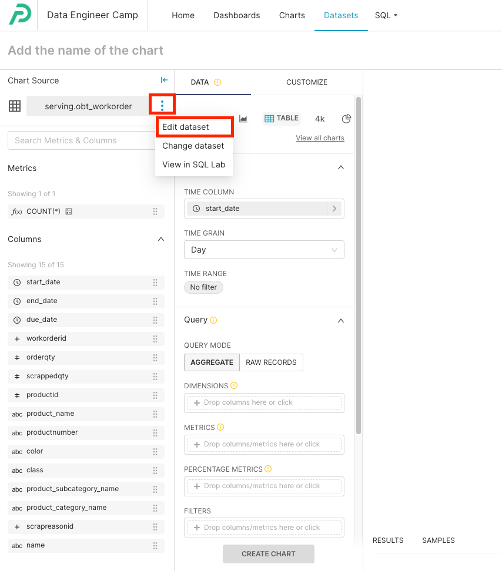
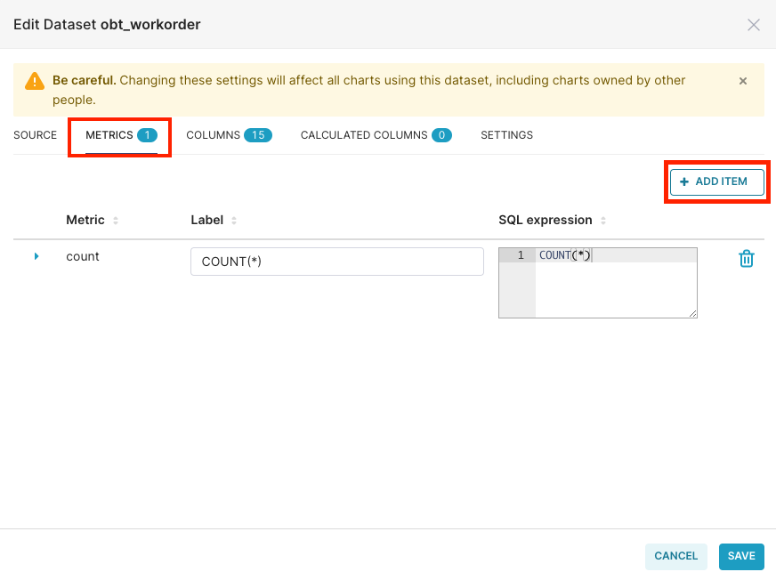
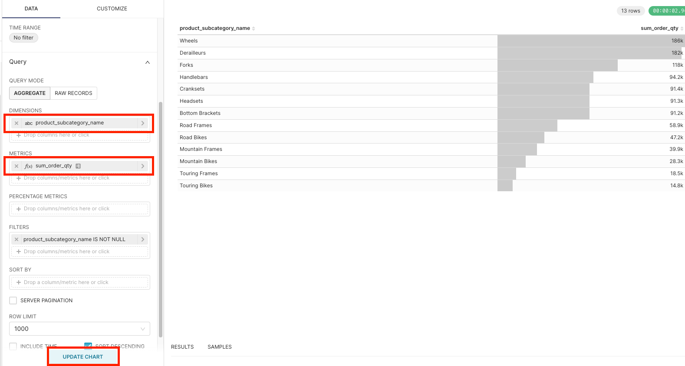
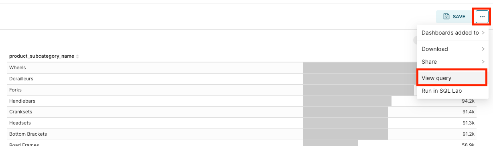
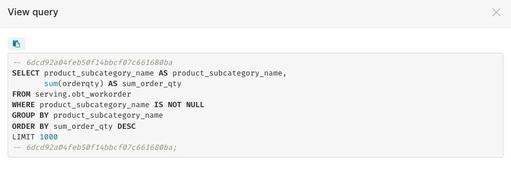
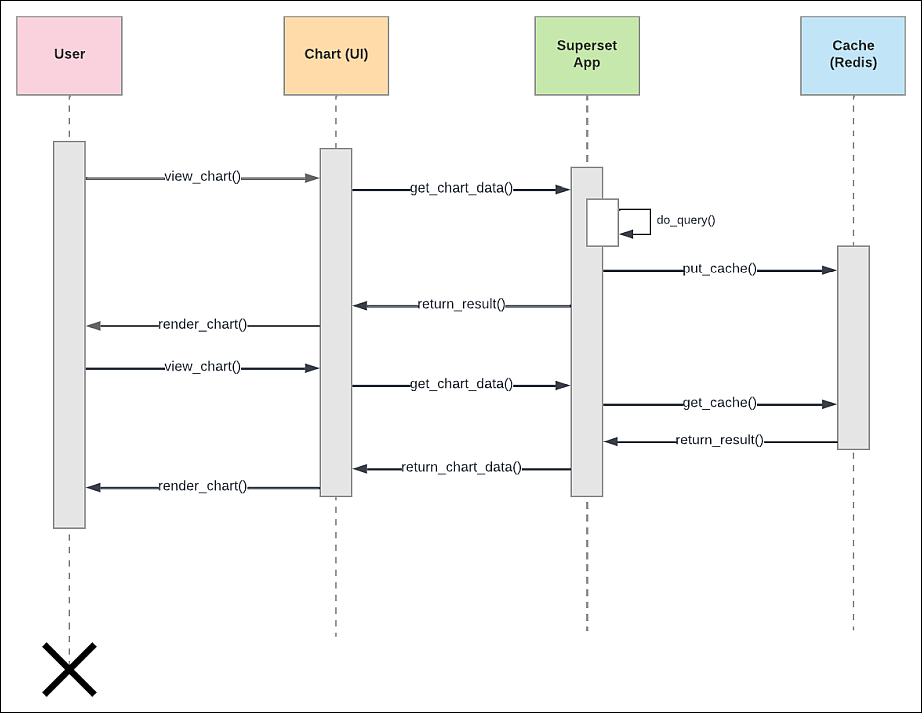
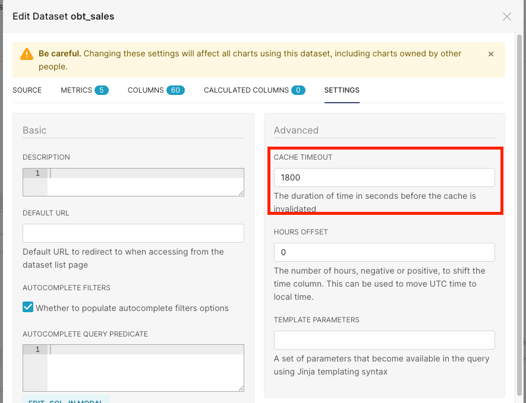

# Instructions 

## Create a new dataset 

1. Go to datasets 
2. Select "+ dataset"
3. Populate the following details:
    - database: postgresql/adventureworks 
    - schema: serving
    - table: obt_workorder 

    

4. Skip the chart creation and just select "Dataset" again from the menu. 

5. Select the dataset "obt_workorder" 

## Create metrics 

1. Edit the dataset 

    

2. Select "metric" and "add item"

    

3. Create the following metrics: 

```yaml
metrics:
  - name: 
    label: sum_order_qty # this is what is displayed 
    sql_expression: sum(orderqty)
  
  - name: avg_order_qty
    label: avg_order_qty # this is what is displayed 
    sql_expression: avg(orderqty)
  
  - name: sum_high_class_order_qty
    label: sum_high_class_order_qtysum_order_qty
    sql_expression: sum(case when class = 'H' then orderqty else 0 end)

  - name: sum_net_quantity
    label: sum_net_quantity
    sql_expression: sum(orderqty - scrappedqty)
  
  - name: max_order_qty
    label: max_order_qty
    sql_expression: max(orderqty)
```

4. Create a table chart and try each one of the metrics individually 

    


5. On the right corner, select "..." and "view query"

    

    

    This is the power of the semantic layer. Non-technical users can drag and drop their fields into "dimensions" and "metrics". The semantic layer will translate their selection as SQL queries that is sent to the data warehouse for execution. 

    The results returned from the data warehouse is then cached in the caching layer for better performance. 

## Caching layer 

Below is a visualization of the caching layer. Take a minute to read it and understand it. 



Read more on the caching layer [here](https://docs.preset.io/docs/caching-in-preset). 

By default, Preset holds data in the cache for 24 hours. If you would like Preset to fetch data from the database at faster intervals (e.g. real-time database), then you can change the cache timeout value to a shorter value e.g. 1800 seconds (30 minutes). 



