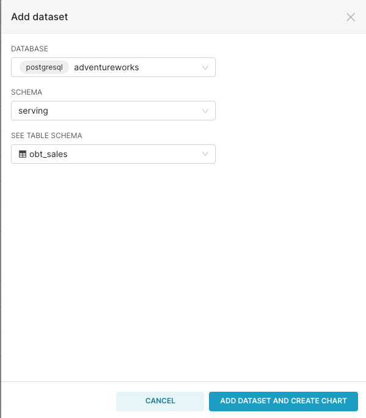
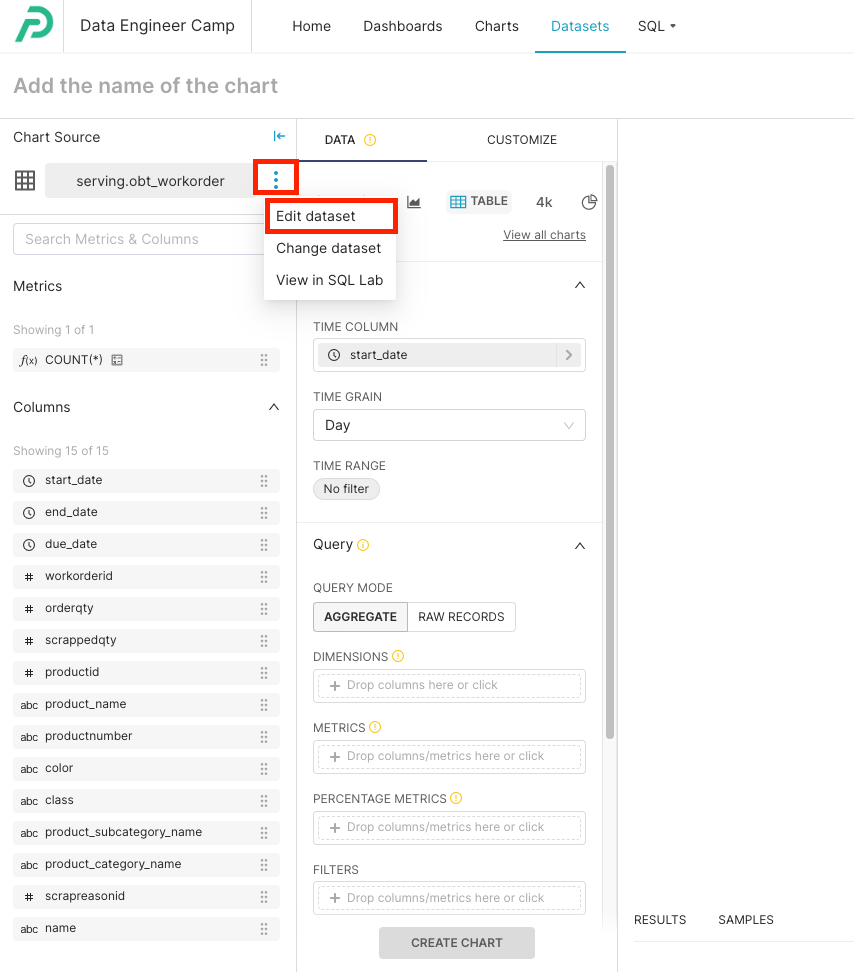
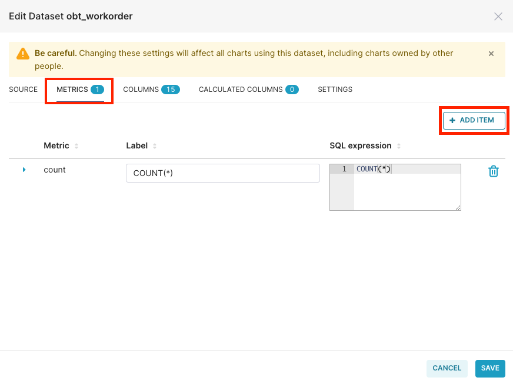
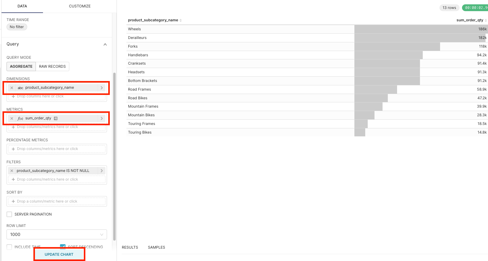
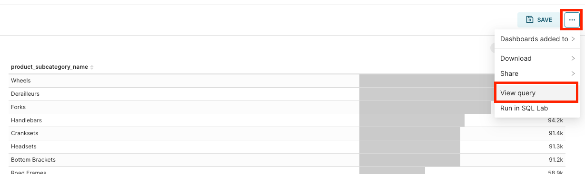
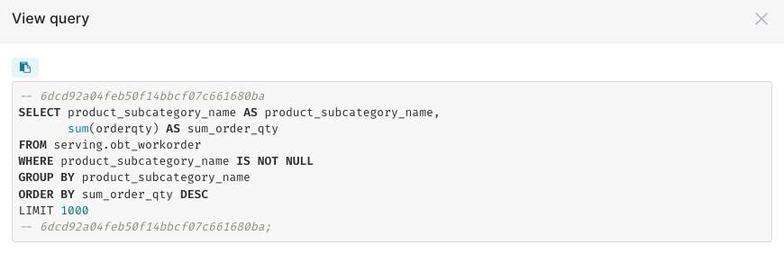
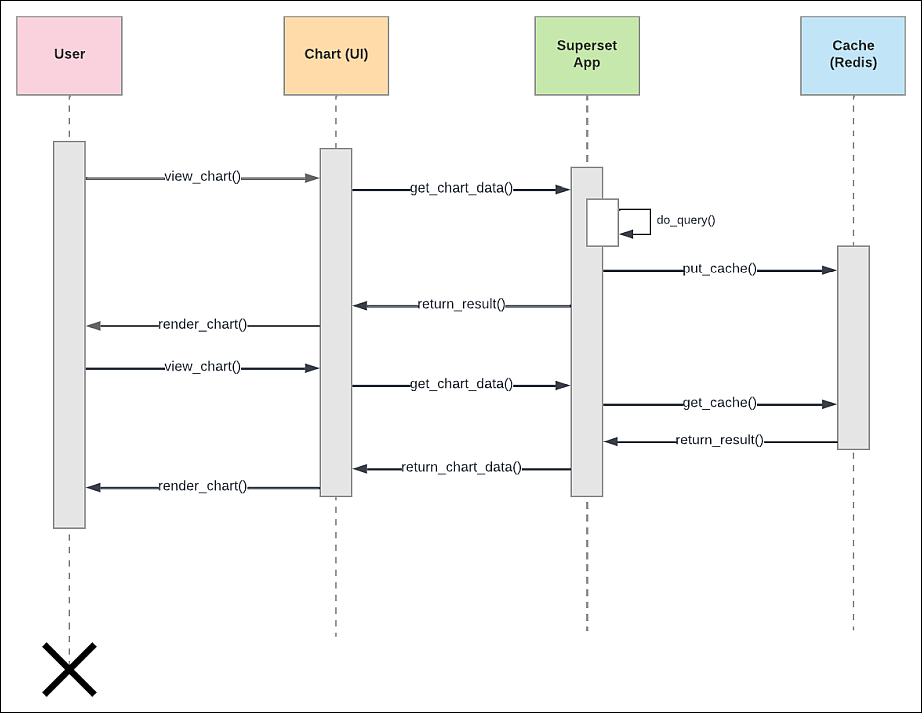
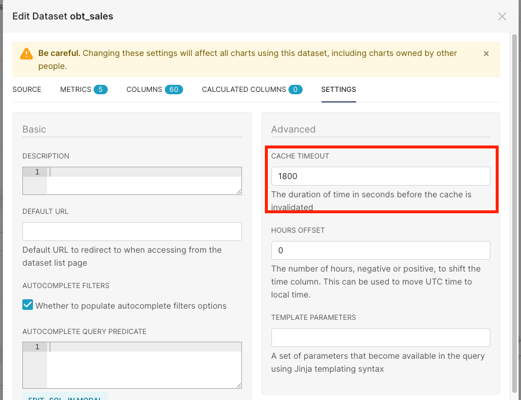

# Instructions 

## Create a new dataset 

1. Go to datasets 
2. Select "+ dataset"
3. Populate the following details:
    - database: postgresql/adventureworks 
    - schema: serving
    - table: obt_sales 

    

4. Skip the chart creation and just select "Dataset" again from the menu. 

5. Select the dataset "obt_sales" 

## Create metrics 

1. Edit the dataset 

    

2. Select "metric" and "add item"

    

3. Create metrics for the following questions: 

  ```yaml
  metrics:
    - question: What was my sales broken down by months? 
    - question: How many quantities of products were sold broken down by category? 
    - question: What was the average unit price of products by subcategory? 
    - question: What was the total sales for the 'Vista' card type?
  ```

  Metrics make use of any allowed SQL functions: 
  - math functions: https://www.postgresql.org/docs/9.1/functions-math.html
  - aggregate functions: https://www.postgresql.org/docs/9.1/functions-aggregate.html

4. Create a table chart and try each one of the metrics individually 

    

5. For each metric, on the right corner, select "..." and "view query"

    

    

    This is the power of the semantic layer. Non-technical users can drag and drop their fields into "dimensions" and "metrics". The semantic layer will translate their selection as SQL queries that is sent to the data warehouse for execution. 

    The results returned from the data warehouse is then cached in the caching layer for better performance. 

## Caching layer 

Below is a visualization of the caching layer. Take a minute to read it and understand it. 



Read more on the caching layer [here](https://docs.preset.io/docs/caching-in-preset). 

By default, Preset holds data in the cache for 24 hours. If you would like Preset to fetch data from the database at faster intervals (e.g. real-time database), then you can change the cache timeout value to a shorter value e.g. 1800 seconds (30 minutes). 


