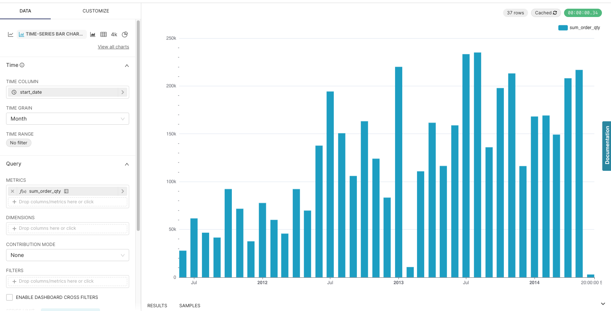
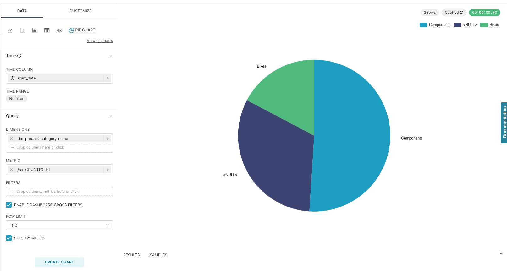
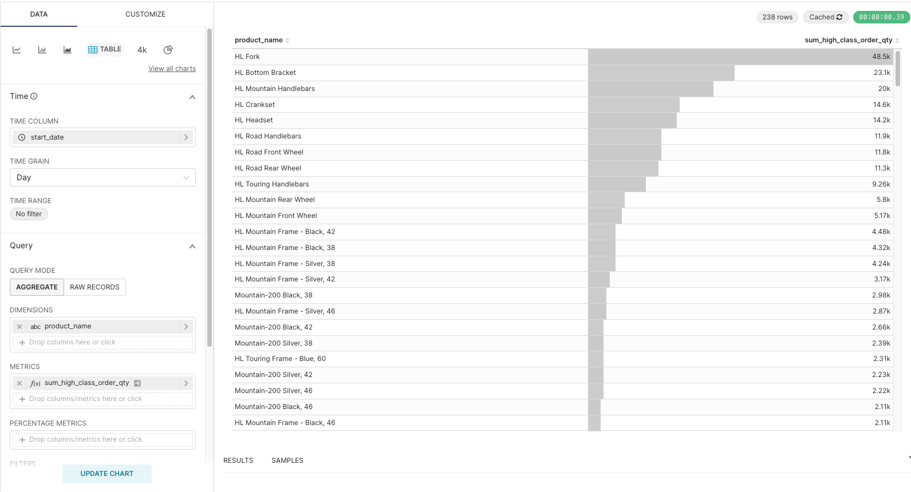
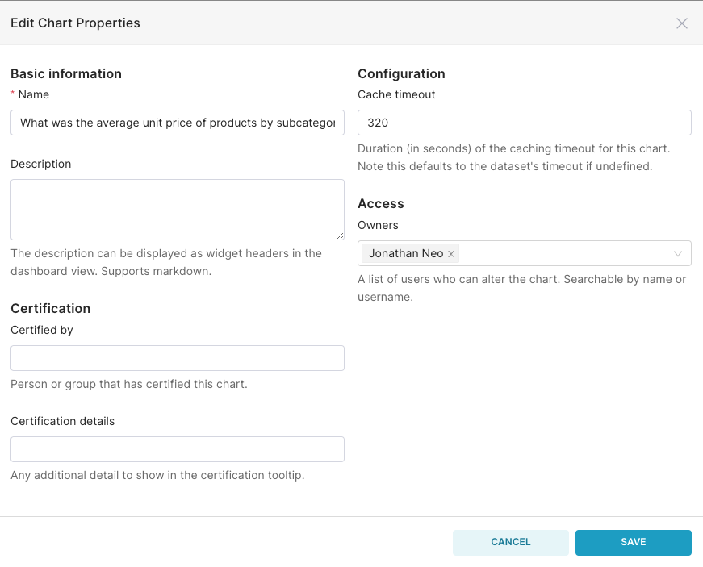

# Instruction

## Concept 

Preset's charts are built on top of ECharts, an open source javascript data visualization library.
- EChart Visualizations: https://echarts.apache.org/examples/en/index.html
- EChart github: https://github.com/apache/echarts

## Creating charts 

Create charts that answer the following questions. Click to reveal the solution. You may use a different or more suitable chart type. 

<strong>How many items were ordered per month?</strong>

<strong>How many items were ordered by product subcategory?</strong>

<strong>How many items were ordered by product?</strong>

## Chart cache

You can also configure the chart cache timeout by going to "..." > "Edit chart properties". The default is 24 hours. 

