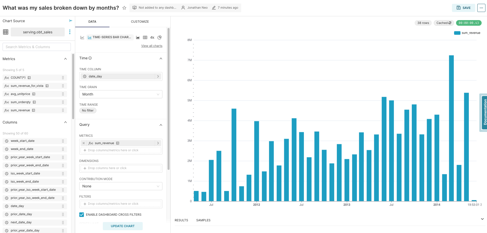
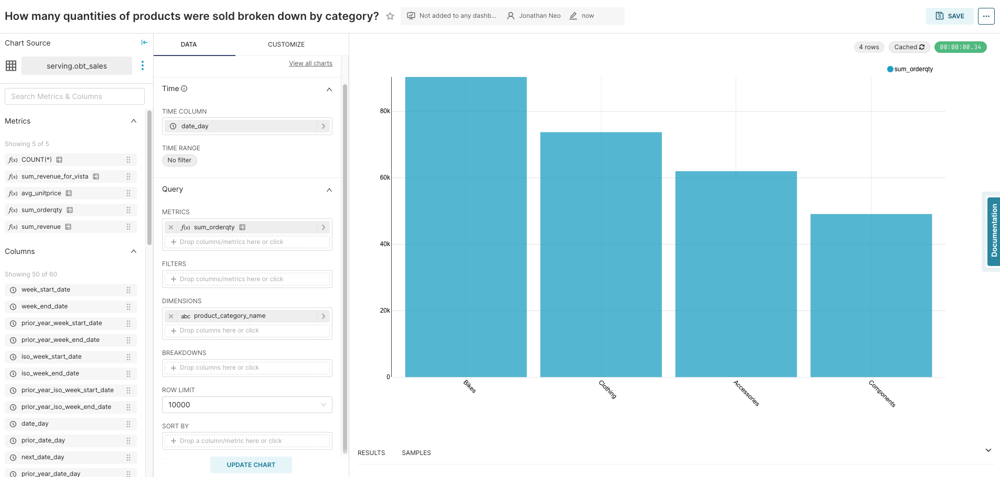
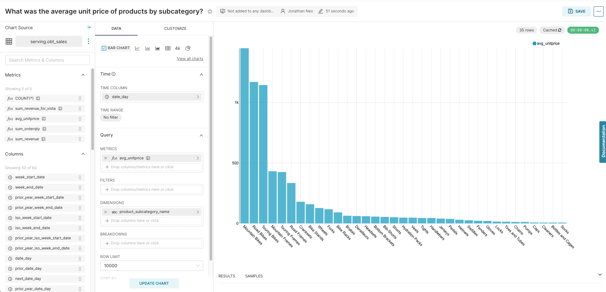
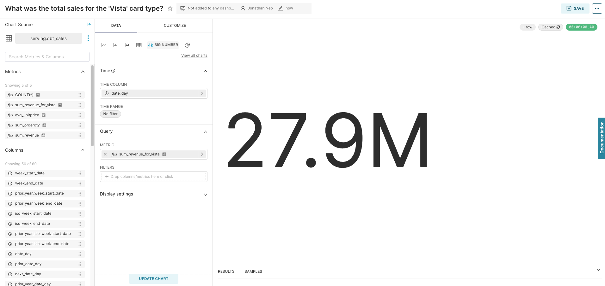
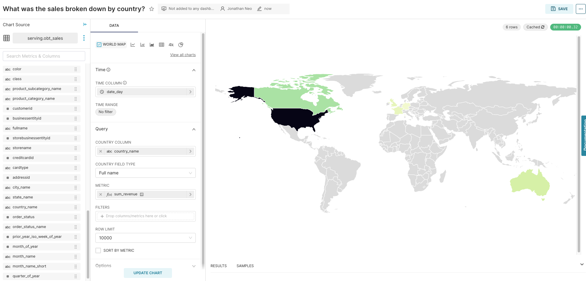
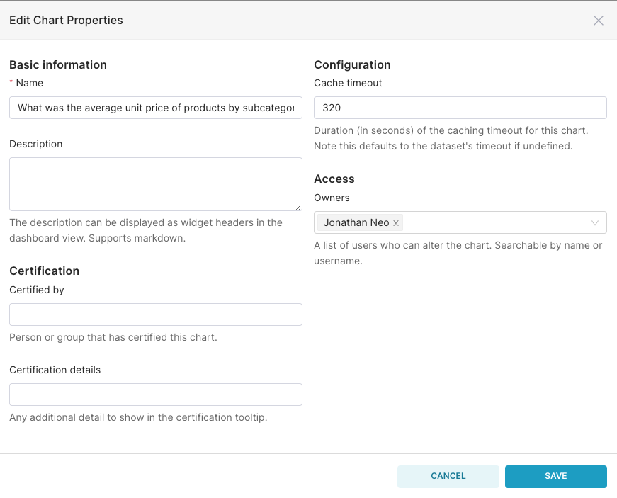

# Instruction

## Concept 

Preset's charts are built on top of ECharts, an open source javascript data visualization library.
- EChart Visualizations: https://echarts.apache.org/examples/en/index.html
- EChart github: https://github.com/apache/echarts

## Creating charts 

Create charts that answer the following questions. Click to reveal the solution. You may use a different or more suitable chart type. 

<strong>What was my sales broken down by months?</strong>

<strong>How many quantities of products were sold broken down by category?</strong>

<strong>What was the average unit price of products by subcategory?</strong>

<strong>What was the total sales for the 'Vista' card type?</strong>

<strong>What was the sales broken down by country?</strong>

## Chart cache

You can also configure the chart cache timeout by going to "..." > "Edit chart properties". The default is 24 hours. 

