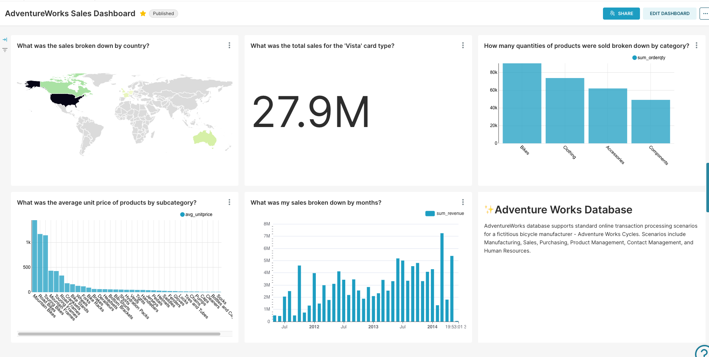
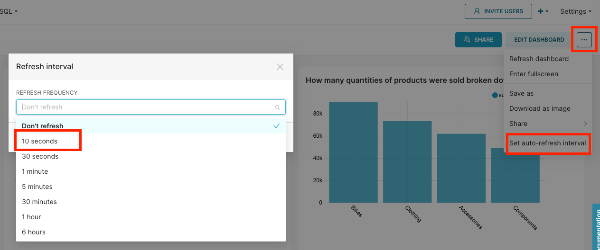

# Instructions

## Create a dashboard 

Create a dashboard by pulling in all the charts you have created in the earlier exercise. 

Your final dashboard should look similar to: 

You can also include filters and cross-filters in your dashboard:
- Filters: https://docs.preset.io/docs/filter-types
- Cross-filters: https://docs.preset.io/docs/cross-filtering

## Refreshing browser 

When you load the dashboard for the first time, notice that the dashboard will take a few seconds to load. 

However, on subsequent refreshes of your browser, the load time drops significantly. This is because the data is stored in the caching layer (redis cache), and the data is fetched from there when the dashboard reloads rather than sending a query to the database. 

## Scheduling dashboard refresh

If you have the dashboard being displayed on a screen, then you may want to have the dashboard refresh itself automatically without a human pressing refresh. 

Try it out by configuring a refresh interval of 10 seconds. 
