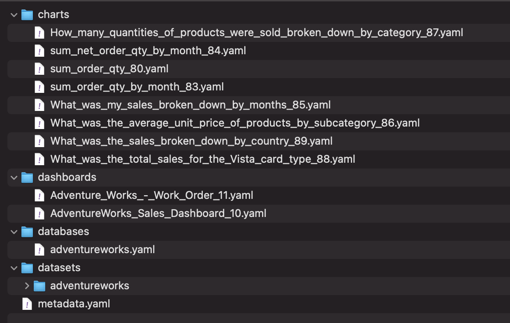

# Instruction

## Export YAML

You can export the YAML config used for dashboards, charts, datasets, and databases. 


The exported `.zip` contains the following folders and files. 



Inspect the files you have downloaded to see what is in the YAML. For example:

```yaml
metrics:
- metric_name: sum_revenue_for_vista
  verbose_name: sum_revenue_for_vista
  metric_type: null
  expression: sum(case when lower(cardtype)='vista' then revenue_wo_taxandfreight
    else 0 end)
  description: null
  d3format: null
  extra: {}
  warning_text: null
- metric_name: sum_revenue
  verbose_name: sum_revenue
  metric_type: null
  expression: sum(revenue_wo_taxandfreight)
  description: null
  d3format: null
  extra: {}
  warning_text: null
```

The YAML files can be used for the following: 
1. Source and version control (Git): store the files in git for version control 
2. Import to another workspace: you may have multiple workspaces for each environment (dev, test prod). You can import the content to different workspaces. 


The enterprise license of Preset includes API access which allows you to perform CI/CD on the YAML files. For more details, see preset docs: 
- Preset API: https://api-docs.preset.io/
- Preset CLI: https://preset.io/blog/version-control-superset-charts-dashboards-superset/

Command to install the CLI: 

```
pip install "git+https://github.com/preset-io/backend-sdk.git"
```

CLI usage: 

```
preset-cli --help
Usage: preset-cli [OPTIONS] COMMAND [ARGS]...

  A CLI for Preset.

Options:
  --baseurl TEXT
  --api-token TEXT
  --api-secret TEXT
  --jwt-token TEXT
  --workspaces TEXT
  --help             Show this message and exit.

Commands:
  auth      Store credentials for auth.
  superset  Send commands to one or more Superset instances.
```
