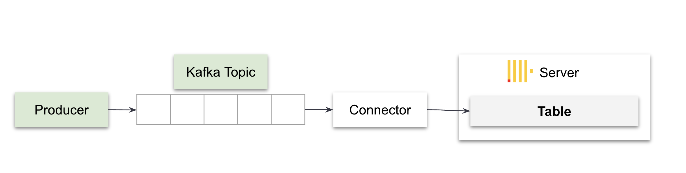

# Instruction

We are going to generate mock github events to a kafka topic using a kafka producer. 




## Steps 

1. Download the `github_all_columns.ndjson` file [here](https://datasets-documentation.s3.eu-west-3.amazonaws.com/kafka/github_all_columns.ndjson)

1. Save the file to the `solved/producer` folder. 

1. Create a new conda environment using `conda create -n kafka-producer python=3.8` 

1. Activate the new conda environment using `conda activate kafka-producer` 

1. Install python dependencies using `pip install -r requirements.txt`. Note: make sure you have `cd` into the directory with the `requirements.txt` file. 

1. Update [github.config](../solved/producer/github.config) with your Confluent kafka cluster URL and API key: 
    - `bootstrap.servers=your_hostname`
    - `sasl.username=your_api_key`
    - `sasl.password=your_api_secret`

1. Update the following variables in `producer.py`: 
    - `input_file="github_all_columns.ndjson"`. 
    - `num_messages=-1` to produce all records, or `num_messages=10000` to produce the first 10,000 records. 


1. Run the [producer.py](../solved/producer/producer.py) by executing `python producer.py -f github.config -t github` where:
    - `-f` is the parameter for the config file 
    - `-t` is the parameter for the topic name 

1. You should see logs like (example only): 
    ```
    Produced record to topic github partition [0] @ offset 304561
    Produced record to topic github partition [0] @ offset 304562
    Produced record to topic github partition [0] @ offset 304563
    Produced record to topic github partition [0] @ offset 304564
    100 messages were produced to topic github!
    ```

    Note: If you are encountering this bug: 
    ```
    ImportError: DLL load failed while importing cimpl: The specified module could not be found.
    ```
    
    Then you will need to modify your python file to add the following import statement at the top of the file: 
    ```python
    from ctypes import *
    CDLL(r"C:\Users\<your_user>\anaconda3\envs\kafka-producer\Lib\site-packages\confluent_kafka.libs\librdkafka<hash>.dll")
    ```

    Example:
    ```python
    from ctypes import *
    CDLL(r"C:\Users\jonathan\anaconda3\envs\kafka-producer\Lib\site-packages\confluent_kafka.libs\librdkafka-0asd9123.dll")
    ```

1. Done! Log in to your Confluent Cloud account and check that a new topic for `github` has been created with messages populated. 


