# Instruction 

Now that we have messages in our kafka topic, we can ingest those messages into a Clickhouse table. 

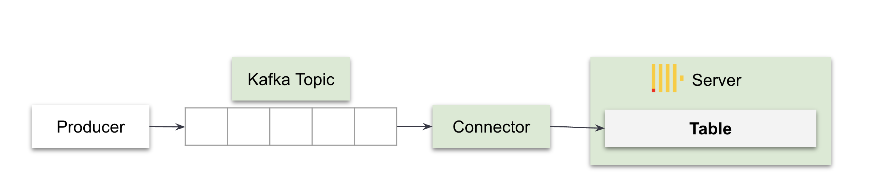

## Steps

1. Create the Clickhouse table by going into your clickhouse service 

    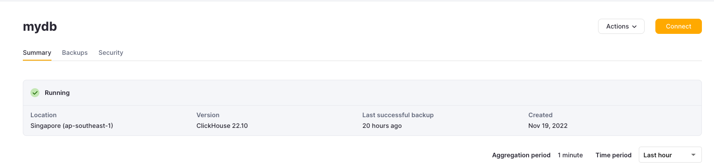

2. Select "Connect" and select "Connect to SQL Console"

    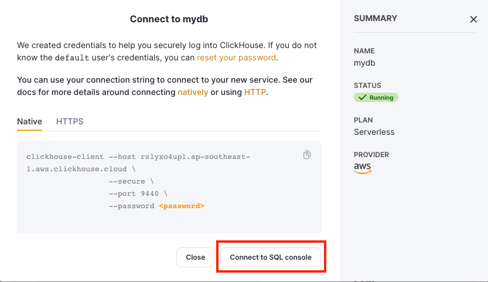

3. Drop the below SQL query in to create the target table. Before running, make sure to put in your password. 

    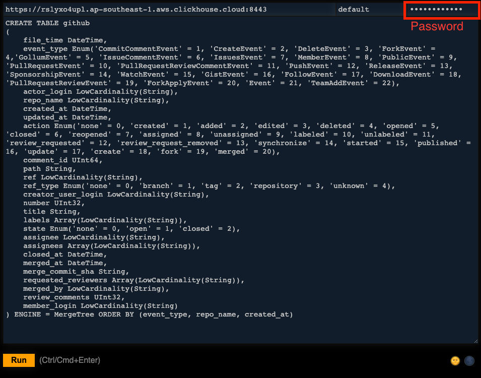

    ```sql
    CREATE TABLE github
    (
        file_time DateTime,
        event_type Enum('CommitCommentEvent' = 1, 'CreateEvent' = 2, 'DeleteEvent' = 3, 'ForkEvent' = 4,'GollumEvent' = 5, 'IssueCommentEvent' = 6, 'IssuesEvent' = 7, 'MemberEvent' = 8, 'PublicEvent' = 9, 'PullRequestEvent' = 10, 'PullRequestReviewCommentEvent' = 11, 'PushEvent' = 12, 'ReleaseEvent' = 13, 'SponsorshipEvent' = 14, 'WatchEvent' = 15, 'GistEvent' = 16, 'FollowEvent' = 17, 'DownloadEvent' = 18, 'PullRequestReviewEvent' = 19, 'ForkApplyEvent' = 20, 'Event' = 21, 'TeamAddEvent' = 22),
        actor_login LowCardinality(String),
        repo_name LowCardinality(String),
        created_at DateTime,
        updated_at DateTime,
        action Enum('none' = 0, 'created' = 1, 'added' = 2, 'edited' = 3, 'deleted' = 4, 'opened' = 5, 'closed' = 6, 'reopened' = 7, 'assigned' = 8, 'unassigned' = 9, 'labeled' = 10, 'unlabeled' = 11, 'review_requested' = 12, 'review_request_removed' = 13, 'synchronize' = 14, 'started' = 15, 'published' = 16, 'update' = 17, 'create' = 18, 'fork' = 19, 'merged' = 20),
        comment_id UInt64,
        path String,
        ref LowCardinality(String),
        ref_type Enum('none' = 0, 'branch' = 1, 'tag' = 2, 'repository' = 3, 'unknown' = 4),
        creator_user_login LowCardinality(String),
        number UInt32,
        title String,
        labels Array(LowCardinality(String)),
        state Enum('none' = 0, 'open' = 1, 'closed' = 2),
        assignee LowCardinality(String),
        assignees Array(LowCardinality(String)),
        closed_at DateTime,
        merged_at DateTime,
        merge_commit_sha String,
        requested_reviewers Array(LowCardinality(String)),
        merged_by LowCardinality(String),
        review_comments UInt32,
        member_login LowCardinality(String)
    ) ENGINE = MergeTree ORDER BY (event_type, repo_name, created_at)

    ```

    Important: The table above uses the [MergeTree engine](https://clickhouse.com/docs/en/engines/table-engines/mergetree-family/mergetree). Read more about it in the link. The `ORDER BY` is used as the primary key for the table, if a primary key is not explicitly specified. This creates an index from primary key columns. 

4. Login to Confluent Cloud and go to Connectors > Add Connector 

5. Select the "HTTP Sink" connector 

    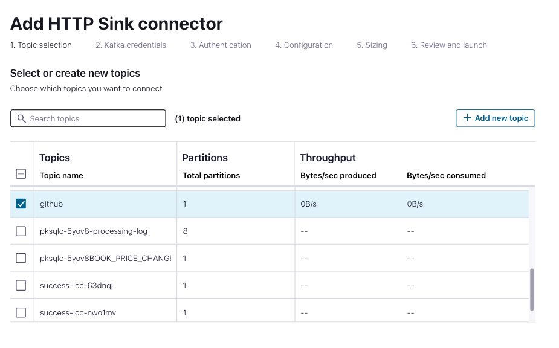

6. Select either "Global access (new API key)" or "Use an existing API key". Make sure to save the API key if you are generating a new one. 

7. Populate the following parameters under "Authentication": 
    - HTTP URL: 
        - Structure: `<protocol>://<clickhouse_host>:<clickhouse_port>?query=INSERT%20INTO%20<database>.<table>%20FORMAT%20JSONEachRow`
        - Example: `https://rslyxo4upl.ap-southeast-1.aws.clickhouse.cloud:8443?query=INSERT%20INTO%20default.github%20FORMAT%20JSONEachRow` 
        - Important: The database is `default`, and the table is `github`. 
    - Auth username: `your_user` i.e. `default
    - Auth password: `your_password` 
    - Endpoint Authentication type: `BASIC` 

    Leave the other fields as default or blank. 

    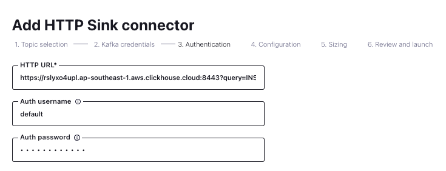

8. Populate the following parameters under "Configuration": 
    - Input Kafak record value format: `JSON` 
    - HTTP Request Method: `POST` 
    - HTTP Headers: `Content-Type: application/json`
    - Request Body Format: `json` 
    - Batch max size: `1000` 

    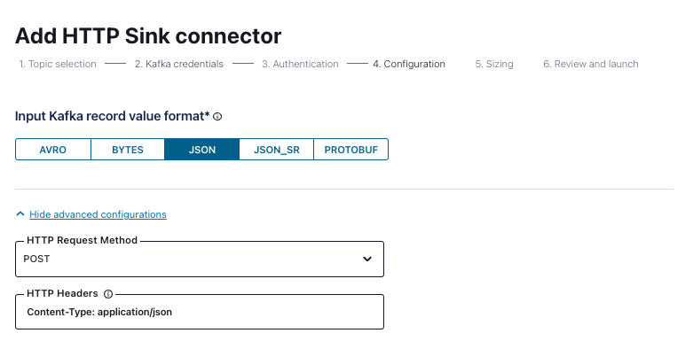

9. Populate the following parameters under "Sizing": 
    - Tasks: `1` 

10. Review and provide a name for your connector e.g. `clickhouse-github`. 

    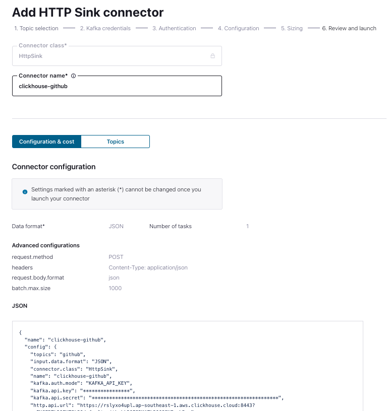


11. Wait for connector to provision. 

    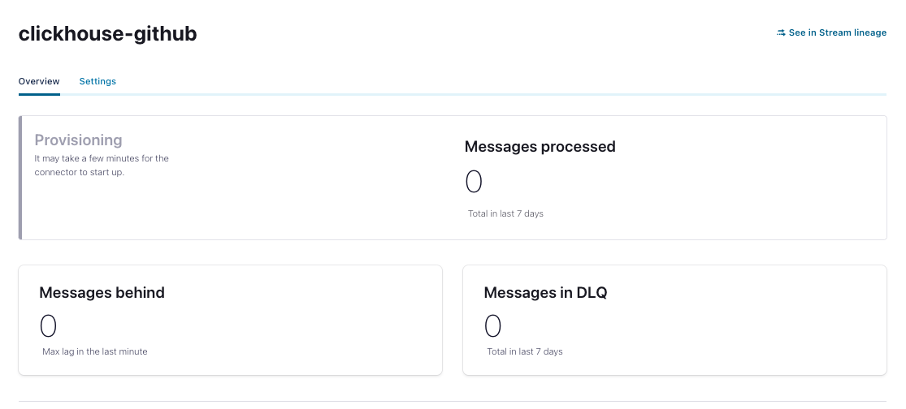

12. Once the connector has provisioned, data should start flowing into the clickhouse table `select * from github` produces: 

    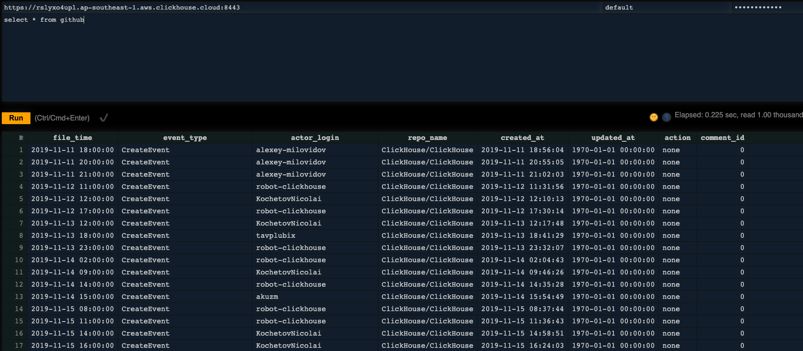

    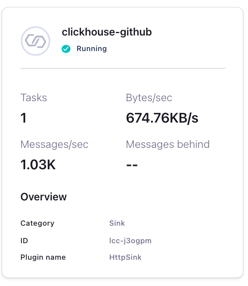


