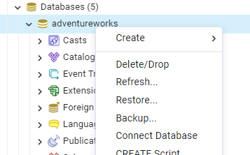
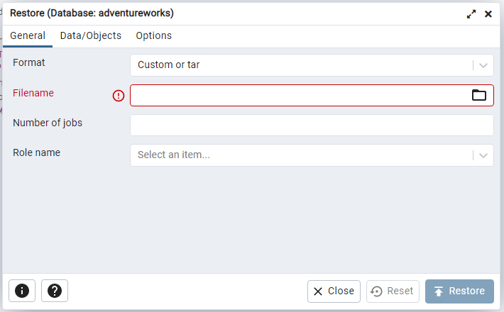
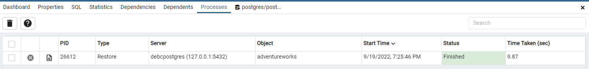

# Adventure Works

## Restore the adventure works database

 1. Download the adv_works_oltp_postgres.sql in the solved folder to your local machine
 2. Open pgAdmin client tool on your machine
 3. Create an empty database in an AWS RDS instance called adventureworks
 4. Right click on adventureworks database and select Restore
 
 5. Select the downloaded file by clicking the folder icon in the file name field, and click Restore button
 
 6. The restore process should finish in 10-20 seconds
 
 7. Run the below SQL statement in adventureworks database to see the tables created

    ```sql
    WITH tbl AS
      (SELECT table_catalog,table_schema,
              TABLE_NAME
      FROM information_schema.tables
      WHERE TABLE_NAME not like 'pg_%'
        AND table_schema in ('person','humanresources','production','purchasing','sales')
          AND table_catalog like 'adventureworks'
      )
    SELECT table_Catalog,table_schema,
          TABLE_NAME,
          (xpath('/row/c/text()', query_to_xml(format('select count(*) as c from %I.%I', table_schema, TABLE_NAME), FALSE, TRUE, '')))[1]::text::int AS rows_n
    FROM tbl
    ORDER BY rows_n DESC;
    ```

  8. The restore process should have copied tables and data

  | table_catalog | table_schema | table_name | rows_n |
| --- | --- | --- | --- |
| adventureworks | sales | salesorderdetail | 121317 |
| adventureworks | production | transactionhistory | 113443 |
| adventureworks | production | transactionhistoryarchive | 89253 |
| adventureworks | production | workorder | 72591 |
| adventureworks | production | workorderrouting | 67131 |
| adventureworks | sales | salesorderheader | 31465 |
| adventureworks | sales | salesorderheadersalesreason | 27647 |
| adventureworks | person | businessentity | 20777 |
| adventureworks | person | personphone | 19972 |
| adventureworks | person | person | 19972 |
| adventureworks | person | emailaddress | 19972 |
| adventureworks | sales | vpersondemographics | 19972 |
| adventureworks | person | password | 19972 |
| adventureworks | person | vadditionalcontactinfo | 19972 |
| adventureworks | sales | customer | 19820 |
| adventureworks | person | address | 19614 |
| adventureworks | person | businessentityaddress | 19614 |
| adventureworks | sales | personcreditcard | 19118 |
| adventureworks | sales | creditcard | 19118 |
| adventureworks | sales | vindividualcustomer | 18508 |
| adventureworks | sales | currencyrate | 13532 |
| adventureworks | purchasing | purchaseorderdetail | 8845 |
| adventureworks | purchasing | purchaseorderheader | 4012 |
| adventureworks | production | billofmaterials | 2679 |
| adventureworks | production | productinventory | 1069 |
| adventureworks | person | businessentitycontact | 909 |
| adventureworks | production | productdescription | 762 |
| adventureworks | production | productmodelproductdescriptionculture | 762 |
| adventureworks | sales | vstorewithcontacts | 753 |
| adventureworks | sales | vstorewithaddresses | 712 |
| adventureworks | sales | store | 701 |
| adventureworks | sales | vstorewithdemographics | 701 |
| adventureworks | sales | specialofferproduct | 538 |
| adventureworks | production | product | 504 |
| adventureworks | production | productproductphoto | 504 |
| adventureworks | purchasing | productvendor | 460 |
| adventureworks | production | productcosthistory | 395 |
| adventureworks | production | productlistpricehistory | 395 |
| adventureworks | humanresources | employeepayhistory | 316 |
| adventureworks | humanresources | employeedepartmenthistory | 296 |
| adventureworks | humanresources | vemployeedepartmenthistory | 296 |
| adventureworks | humanresources | employee | 290 |
| adventureworks | humanresources | vemployee | 290 |
| adventureworks | humanresources | vemployeedepartment | 290 |
| adventureworks | person | countryregion | 238 |
| adventureworks | person | stateprovince | 181 |
| adventureworks | sales | salespersonquotahistory | 163 |
| adventureworks | purchasing | vvendorwithcontacts | 156 |
| adventureworks | production | productmodel | 128 |
| adventureworks | sales | countryregioncurrency | 109 |
| adventureworks | sales | currency | 105 |
| adventureworks | purchasing | vvendorwithaddresses | 104 |
| adventureworks | purchasing | vendor | 104 |
| adventureworks | production | productphoto | 101 |
| adventureworks | sales | vsalespersonsalesbyfiscalyearsdata | 48 |
| adventureworks | production | unitmeasure | 38 |
| adventureworks | production | productsubcategory | 37 |
| adventureworks | production | productdocument | 32 |
| adventureworks | humanresources | vjobcandidateemployment | 30 |
| adventureworks | sales | salestaxrate | 29 |
| adventureworks | person | contacttype | 20 |
| adventureworks | sales | vsalesperson | 17 |
| adventureworks | sales | salesterritoryhistory | 17 |
| adventureworks | sales | salesperson | 17 |
| adventureworks | humanresources | vjobcandidateeducation | 16 |
| adventureworks | production | scrapreason | 16 |
| adventureworks | humanresources | department | 16 |
| adventureworks | sales | specialoffer | 16 |
| adventureworks | sales | vsalespersonsalesbyfiscalyears | 14 |
| adventureworks | production | location | 14 |
| adventureworks | humanresources | vjobcandidate | 13 |
| adventureworks | production | document | 13 |
| adventureworks | humanresources | jobcandidate | 13 |
| adventureworks | sales | salesreason | 10 |
| adventureworks | sales | salesterritory | 10 |
| adventureworks | production | culture | 8 |
| adventureworks | production | productmodelillustration | 7 |
| adventureworks | production | vproductmodelcatalogdescription | 6 |
| adventureworks | person | addresstype | 6 |
| adventureworks | purchasing | shipmethod | 5 |
| adventureworks | production | illustration | 5 |
| adventureworks | production | productcategory | 4 |
| adventureworks | production | productreview | 4 |
| adventureworks | humanresources | shift | 3 |
| adventureworks | person | phonenumbertype | 3 |
| adventureworks | sales | shoppingcartitem | 3 |
| adventureworks | production | vproductmodelinstructions | 0 |
